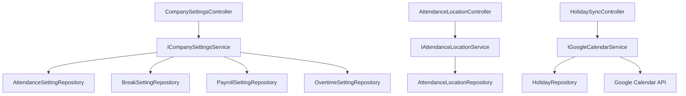

# Design Document: Company Settings Refactor

## Overview

Refactor hệ thống cấu hình công ty từ lưu trữ JSONB trong bảng `company_settings` sang các bảng riêng biệt cho từng domain. Bổ sung tính năng cấu hình nghỉ cuối tuần/ngày lễ, quản lý vị trí chấm công với Google Maps, và tích hợp Google Calendar API để sync ngày lễ quốc gia.

Phạm vi thay đổi:

- **Backend**: Tạo 5 entity mới (AttendanceSetting, BreakSetting, PayrollSetting, OvertimeSetting, AttendanceLocation), refactor service/controller, Flyway migration
- **Frontend**: Cập nhật TypeScript types, API layer, thêm UI cho weekend/holiday off, location management, holiday sync
- **Không xử lý**: Allowance/Deduction (đã có table riêng)

## Architecture

### Hiện tại (JSONB)

```
company_settings (1 row per tenant)
├── attendance_config  JSONB
├── break_config       JSONB
├── payroll_config     JSONB
├── overtime_config    JSONB
└── deduction_config   JSONB
```

### Sau refactor (Dedicated Tables)

```
attendance_settings (1 row per tenant)
├── typed columns cho tất cả attendance fields
├── saturday_off, sunday_off, holiday_off  (MỚI)
└── FK references

break_settings (1 row per tenant)
├── typed columns cho tất cả break fields

payroll_settings (1 row per tenant)
├── typed columns cho tất cả payroll fields

overtime_settings (1 row per tenant)
├── typed columns cho tất cả overtime fields

attendance_locations (N rows per tenant)  (MỚI)
├── name, address, latitude, longitude, radius
└── soft delete

holidays (existing table - enhanced with Google Calendar sync)
```

### Layer Flow



## Components and Interfaces

### Backend Entities

#### AttendanceSettingEntity

```java
@Entity
@Table(name = "attendance_settings")
public class AttendanceSettingEntity extends BaseEntity {
    private Boolean deleted = false;
    // Giờ làm việc
    private LocalTime defaultWorkStartTime;
    private LocalTime defaultWorkEndTime;
    private Integer defaultBreakMinutes;
    // Rounding
    private Boolean enableRounding;
    private Boolean enableCheckInRounding;
    private Boolean enableCheckOutRounding;
    private Boolean enableBreakStartRounding;
    private Boolean enableBreakEndRounding;
    private String checkInRoundingInterval;    // enum as string
    private String checkInRoundingDirection;
    private String checkOutRoundingInterval;
    private String checkOutRoundingDirection;
    private String breakStartRoundingInterval;
    private String breakStartRoundingDirection;
    private String breakEndRoundingInterval;
    private String breakEndRoundingDirection;
    // Grace period
    private Integer lateGraceMinutes;
    private Integer earlyLeaveGraceMinutes;
    // Device & Location
    private Boolean requireDeviceRegistration;
    private Boolean requireGeoLocation;
    private Integer geoFenceRadiusMeters;
    private Boolean allowMobileCheckIn;
    private Boolean allowWebCheckIn;
    // Weekend & Holiday off (MỚI)
    private Boolean saturdayOff;
    private Boolean sundayOff;
    private Boolean holidayOff;
}
```

#### BreakSettingEntity

```java
@Entity
@Table(name = "break_settings")
public class BreakSettingEntity extends BaseEntity {
    private Boolean deleted = false;
    private Boolean breakEnabled;
    private String breakType;  // PAID, UNPAID
    private Integer defaultBreakMinutes;
    private Integer minimumBreakMinutes;
    private Integer maximumBreakMinutes;
    private Boolean useLegalMinimum;
    private String locale;
    private Boolean fixedBreakMode;
    private Integer breakPeriodsPerAttendance;
    private Integer maxBreaksPerDay;
    @JdbcTypeCode(SqlTypes.JSON)
    private String fixedBreakPeriods;  // Giữ JSONB cho array of BreakPeriod
    private LocalTime nightShiftStartTime;
    private LocalTime nightShiftEndTime;
    private Integer nightShiftMinimumBreakMinutes;
    private Integer nightShiftDefaultBreakMinutes;
}
```

#### PayrollSettingEntity

```java
@Entity
@Table(name = "payroll_settings")
public class PayrollSettingEntity extends BaseEntity {
    private Boolean deleted = false;
    private String defaultSalaryType;  // MONTHLY, HOURLY, DAILY
    private Integer payDay;
    private Integer cutoffDay;
    private String salaryRounding;
    private Integer standardWorkingDaysPerMonth;
    private Integer standardWorkingHoursPerDay;
}
```

#### OvertimeSettingEntity

```java
@Entity
@Table(name = "overtime_settings")
public class OvertimeSettingEntity extends BaseEntity {
    private Boolean deleted = false;
    private Boolean overtimeEnabled;
    private Boolean requireApproval;
    private Integer standardWorkingHours;
    private LocalTime nightStartTime;
    private LocalTime nightEndTime;
    private BigDecimal regularOvertimeRate;
    private BigDecimal nightWorkRate;
    private BigDecimal nightOvertimeRate;
    private BigDecimal holidayOvertimeRate;
    private BigDecimal holidayNightOvertimeRate;
    private BigDecimal weekendOvertimeRate;
    private Boolean useLegalMinimum;
    private String locale;
    private Integer maxOvertimeHoursPerDay;
    private Integer maxOvertimeHoursPerMonth;
}
```

#### AttendanceLocationEntity

```java
@Entity
@Table(name = "attendance_locations")
public class AttendanceLocationEntity extends BaseEntity {
    private Boolean deleted = false;
    private String name;
    private String address;
    private Double latitude;
    private Double longitude;
    private Integer radiusMeters;
    private Boolean isActive;
}
```

### Backend Services

#### ICompanySettingsService (refactored)

Giữ nguyên interface hiện tại, nhưng implementation đọc/ghi từ các bảng riêng thay vì JSONB.

#### IAttendanceLocationService (mới)

```java
public interface IAttendanceLocationService {
    Page<AttendanceLocationResponse> getLocations(Pageable pageable);
    AttendanceLocationResponse getLocation(Long id);
    AttendanceLocationResponse createLocation(CreateAttendanceLocationRequest request);
    AttendanceLocationResponse updateLocation(Long id, UpdateAttendanceLocationRequest request);
    void deleteLocation(Long id);
}
```

#### IGoogleCalendarService (mới)

```java
public interface IGoogleCalendarService {
    List<HolidayResponse> syncHolidays(String locale, Integer year);
}
```

Google Calendar API integration:

- Endpoint: `https://www.googleapis.com/calendar/v3/calendars/{calendarId}/events`
- Calendar IDs:
  - Vietnam: `vi.vietnamese#holiday@group.v.calendar.google.com`
  - Japan: `ja.japanese#holiday@group.v.calendar.google.com`
- API Key: Configured in `application.properties` as `google.calendar.api-key`
- Sử dụng `RestTemplate` để gọi API

### Backend Controllers

#### CompanySettingsController (refactored)

Giữ nguyên endpoints, chỉ thay đổi implementation bên dưới.

#### AttendanceLocationController (mới)

```
GET    /api/company/settings/locations          - Danh sách vị trí (pageable)
GET    /api/company/settings/locations/{id}     - Chi tiết vị trí
POST   /api/company/settings/locations          - Tạo vị trí mới
PUT    /api/company/settings/locations/{id}     - Cập nhật vị trí
DELETE /api/company/settings/locations/{id}     - Xóa vị trí (soft delete)
```

#### HolidaySyncController (mới hoặc thêm vào CompanySettingsController)

```
POST   /api/company/settings/holidays/sync     - Sync ngày lễ từ Google Calendar
GET    /api/company/settings/holidays           - Danh sách ngày lễ đã sync
```

### Frontend Components

#### Cập nhật TypeScript Types

- Thêm `saturdayOff`, `sundayOff`, `holidayOff` vào `AttendanceConfig`
- Tạo `AttendanceLocation` type
- Tạo `HolidaySyncResponse` type

#### Cập nhật API Layer

- `company-settings-api.ts`: Giữ nguyên endpoints (backend transparent)
- Thêm `attendance-location-api.ts`: CRUD cho locations
- Thêm holiday sync API functions

#### Cập nhật Settings UI

- `_attendance-config-form.tsx`: Thêm section Weekend/Holiday Off toggles
- `_location-management-section.tsx` (mới): CRUD table cho locations + Google Maps link
- `_holiday-sync-section.tsx` (mới): Button sync + danh sách holidays
- `_location-dialog.tsx` (mới): Dialog tạo/sửa location với map picker

### Caching Strategy

#### CompanySettingsCache (refactored)

Thay vì cache 1 entity duy nhất, cache từng setting entity riêng biệt:

```java
@Component
@RequestScope
public class CompanySettingsCache {
    private AttendanceSettingEntity cachedAttendanceSetting;
    private BreakSettingEntity cachedBreakSetting;
    private PayrollSettingEntity cachedPayrollSetting;
    private OvertimeSettingEntity cachedOvertimeSetting;
    private boolean attendanceQueried = false;
    private boolean breakQueried = false;
    private boolean payrollQueried = false;
    private boolean overtimeQueried = false;

    // Getter/setter/invalidate cho từng loại
    public void invalidateAttendance() { ... }
    public void invalidateBreak() { ... }
    public void invalidateAll() { ... }
}
```

## Data Models

### Database Schema (Flyway Migration)

#### attendance_settings

```sql
CREATE TABLE attendance_settings (
    id BIGSERIAL PRIMARY KEY,
    default_work_start_time TIME DEFAULT '09:00',
    default_work_end_time TIME DEFAULT '18:00',
    default_break_minutes INTEGER DEFAULT 60,
    enable_rounding BOOLEAN DEFAULT FALSE,
    enable_check_in_rounding BOOLEAN DEFAULT FALSE,
    enable_check_out_rounding BOOLEAN DEFAULT FALSE,
    enable_break_start_rounding BOOLEAN DEFAULT FALSE,
    enable_break_end_rounding BOOLEAN DEFAULT FALSE,
    check_in_rounding_interval VARCHAR(20),
    check_in_rounding_direction VARCHAR(20),
    check_out_rounding_interval VARCHAR(20),
    check_out_rounding_direction VARCHAR(20),
    break_start_rounding_interval VARCHAR(20),
    break_start_rounding_direction VARCHAR(20),
    break_end_rounding_interval VARCHAR(20),
    break_end_rounding_direction VARCHAR(20),
    late_grace_minutes INTEGER DEFAULT 0,
    early_leave_grace_minutes INTEGER DEFAULT 0,
    require_device_registration BOOLEAN DEFAULT FALSE,
    require_geo_location BOOLEAN DEFAULT FALSE,
    geo_fence_radius_meters INTEGER DEFAULT 100,
    allow_mobile_check_in BOOLEAN DEFAULT TRUE,
    allow_web_check_in BOOLEAN DEFAULT TRUE,
    saturday_off BOOLEAN DEFAULT TRUE,
    sunday_off BOOLEAN DEFAULT TRUE,
    holiday_off BOOLEAN DEFAULT TRUE,
    deleted BOOLEAN NOT NULL DEFAULT FALSE,
    created_at TIMESTAMP NOT NULL DEFAULT CURRENT_TIMESTAMP,
    created_by VARCHAR(50),
    updated_at TIMESTAMP NOT NULL DEFAULT CURRENT_TIMESTAMP,
    updated_by VARCHAR(50)
);
CREATE INDEX idx_attendance_settings_deleted ON attendance_settings(deleted);
```

#### break_settings

```sql
CREATE TABLE break_settings (
    id BIGSERIAL PRIMARY KEY,
    break_enabled BOOLEAN DEFAULT TRUE,
    break_type VARCHAR(20) DEFAULT 'UNPAID',
    default_break_minutes INTEGER DEFAULT 60,
    minimum_break_minutes INTEGER DEFAULT 45,
    maximum_break_minutes INTEGER DEFAULT 90,
    use_legal_minimum BOOLEAN DEFAULT TRUE,
    locale VARCHAR(10) DEFAULT 'ja',
    fixed_break_mode BOOLEAN DEFAULT FALSE,
    break_periods_per_attendance INTEGER DEFAULT 1,
    max_breaks_per_day INTEGER DEFAULT 3,
    fixed_break_periods JSONB DEFAULT '[]',
    night_shift_start_time TIME DEFAULT '22:00',
    night_shift_end_time TIME DEFAULT '05:00',
    night_shift_minimum_break_minutes INTEGER DEFAULT 45,
    night_shift_default_break_minutes INTEGER DEFAULT 60,
    deleted BOOLEAN NOT NULL DEFAULT FALSE,
    created_at TIMESTAMP NOT NULL DEFAULT CURRENT_TIMESTAMP,
    created_by VARCHAR(50),
    updated_at TIMESTAMP NOT NULL DEFAULT CURRENT_TIMESTAMP,
    updated_by VARCHAR(50)
);
CREATE INDEX idx_break_settings_deleted ON break_settings(deleted);
```

#### payroll_settings

```sql
CREATE TABLE payroll_settings (
    id BIGSERIAL PRIMARY KEY,
    default_salary_type VARCHAR(20) DEFAULT 'MONTHLY',
    pay_day INTEGER DEFAULT 25,
    cutoff_day INTEGER DEFAULT 20,
    salary_rounding VARCHAR(20) DEFAULT 'NEAREST',
    standard_working_days_per_month INTEGER DEFAULT 22,
    standard_working_hours_per_day INTEGER DEFAULT 8,
    deleted BOOLEAN NOT NULL DEFAULT FALSE,
    created_at TIMESTAMP NOT NULL DEFAULT CURRENT_TIMESTAMP,
    created_by VARCHAR(50),
    updated_at TIMESTAMP NOT NULL DEFAULT CURRENT_TIMESTAMP,
    updated_by VARCHAR(50)
);
CREATE INDEX idx_payroll_settings_deleted ON payroll_settings(deleted);
```

#### overtime_settings

```sql
CREATE TABLE overtime_settings (
    id BIGSERIAL PRIMARY KEY,
    overtime_enabled BOOLEAN DEFAULT TRUE,
    require_approval BOOLEAN DEFAULT FALSE,
    standard_working_hours INTEGER DEFAULT 8,
    night_start_time TIME DEFAULT '22:00',
    night_end_time TIME DEFAULT '05:00',
    regular_overtime_rate DECIMAL(5,2) DEFAULT 1.25,
    night_work_rate DECIMAL(5,2) DEFAULT 1.25,
    night_overtime_rate DECIMAL(5,2) DEFAULT 1.50,
    holiday_overtime_rate DECIMAL(5,2) DEFAULT 1.35,
    holiday_night_overtime_rate DECIMAL(5,2) DEFAULT 1.60,
    weekend_overtime_rate DECIMAL(5,2) DEFAULT 1.35,
    use_legal_minimum BOOLEAN DEFAULT TRUE,
    locale VARCHAR(10) DEFAULT 'ja',
    max_overtime_hours_per_day INTEGER DEFAULT 4,
    max_overtime_hours_per_month INTEGER DEFAULT 45,
    deleted BOOLEAN NOT NULL DEFAULT FALSE,
    created_at TIMESTAMP NOT NULL DEFAULT CURRENT_TIMESTAMP,
    created_by VARCHAR(50),
    updated_at TIMESTAMP NOT NULL DEFAULT CURRENT_TIMESTAMP,
    updated_by VARCHAR(50)
);
CREATE INDEX idx_overtime_settings_deleted ON overtime_settings(deleted);
```

#### attendance_locations

```sql
CREATE TABLE attendance_locations (
    id BIGSERIAL PRIMARY KEY,
    name VARCHAR(200) NOT NULL,
    address VARCHAR(500),
    latitude DOUBLE PRECISION NOT NULL,
    longitude DOUBLE PRECISION NOT NULL,
    radius_meters INTEGER NOT NULL DEFAULT 100,
    is_active BOOLEAN NOT NULL DEFAULT TRUE,
    deleted BOOLEAN NOT NULL DEFAULT FALSE,
    created_at TIMESTAMP NOT NULL DEFAULT CURRENT_TIMESTAMP,
    created_by VARCHAR(50),
    updated_at TIMESTAMP NOT NULL DEFAULT CURRENT_TIMESTAMP,
    updated_by VARCHAR(50)
);
CREATE INDEX idx_attendance_locations_deleted ON attendance_locations(deleted);
CREATE INDEX idx_attendance_locations_active ON attendance_locations(is_active);
```

### Migration Strategy

Flyway migration script sẽ:

1. Tạo các bảng mới
2. Migrate dữ liệu từ JSONB columns sang bảng mới bằng SQL `jsonb_extract_path_text()`
3. Xử lý null JSONB bằng `COALESCE` với default values
4. Drop JSONB columns từ `company_settings`

```sql
-- Ví dụ migration cho attendance_settings
INSERT INTO attendance_settings (
    default_work_start_time, default_work_end_time, ...
)
SELECT
    COALESCE((attendance_config->>'defaultWorkStartTime')::TIME, '09:00'),
    COALESCE((attendance_config->>'defaultWorkEndTime')::TIME, '18:00'),
    ...
FROM company_settings WHERE deleted = false;
```

## Correctness Properties

_A property is a characteristic or behavior that should hold true across all valid executions of a system — essentially, a formal statement about what the system should do. Properties serve as the bridge between human-readable specifications and machine-verifiable correctness guarantees._

### Property 1: Migration data preservation (round-trip)

_For any_ valid JSONB config data (attendanceConfig, breakConfig, payrollConfig, overtimeConfig), after the Flyway migration runs, reading the corresponding typed columns from the new table should produce values equivalent to the original JSONB fields.

**Validates: Requirements 1.2, 2.2, 3.2, 4.2**

### Property 2: Settings API write/read round-trip

_For any_ valid settings update request (attendance, break, payroll, or overtime), writing the settings via the API and then reading them back should return data equivalent to the original request values.

**Validates: Requirements 1.3, 2.3, 3.3, 4.3**

### Property 3: Location coordinate and radius validation

_For any_ latitude value outside [-90, 90], longitude value outside [-180, 180], or radius value ≤ 0, the Location API should reject the request with a validation error. Conversely, for any values within valid ranges, the API should accept the request.

**Validates: Requirements 5.2**

### Property 4: Soft delete exclusion from active queries

_For any_ set of attendance locations where some have been soft-deleted, querying active locations should never return a location with `deleted = true`.

**Validates: Requirements 5.6, 5.7**

### Property 5: Holiday sync idempotence

_For any_ set of holidays for a given year, syncing the same holidays multiple times should result in the same number of holiday entries as syncing once — no duplicates should be created.

**Validates: Requirements 6.6**

### Property 6: Cache invalidation correctness

_For any_ setting type, if a setting is updated within a request and then read again in the same request, the read should return the updated value, not the previously cached value.

**Validates: Requirements 8.2**

## Error Handling

### API Validation Errors

| Scenario                                                                      | Error Code                       | HTTP Status |
| ----------------------------------------------------------------------------- | -------------------------------- | ----------- |
| Invalid attendance setting fields (null required fields, invalid time ranges) | `INVALID_ATTENDANCE_SETTING`     | 400         |
| Invalid break setting fields (min > max break minutes)                        | `INVALID_BREAK_SETTING`          | 400         |
| Invalid payroll setting fields (payDay/cutoffDay out of 1-31 range)           | `INVALID_PAYROLL_SETTING`        | 400         |
| Invalid overtime setting fields (negative rates, min > max hours)             | `INVALID_OVERTIME_SETTING`       | 400         |
| Invalid location coordinates (lat/lng out of range, radius ≤ 0)               | `INVALID_LOCATION`               | 400         |
| Location not found                                                            | `LOCATION_NOT_FOUND`             | 404         |
| Setting not found (no row in new table for tenant)                            | `SETTING_NOT_FOUND`              | 404         |
| Google Calendar API unavailable                                               | `GOOGLE_CALENDAR_ERROR`          | 502         |
| Google Calendar API key not configured                                        | `GOOGLE_CALENDAR_NOT_CONFIGURED` | 500         |

### Migration Error Handling

- Null JSONB columns → Insert default values (handled by `COALESCE` in SQL)
- Invalid/corrupt JSONB → Log error with tenant identifier, apply default values, continue migration
- Migration script uses `BEGIN/COMMIT` transaction per tenant to ensure atomicity

### Service Layer Error Handling

```java
// Khi setting chưa tồn tại cho tenant → tự tạo với default values
if (setting == null) {
    setting = createDefaultSetting();
    repository.save(setting);
}
```

## Testing Strategy

### Property-Based Testing

Sử dụng **jqwik** (Java property-based testing library) cho backend.

Mỗi property test chạy tối thiểu 100 iterations.

Mỗi test phải có comment tag theo format: `Feature: company-settings-refactor, Property {number}: {property_text}`

#### Property Tests

1. **Settings write/read round-trip** (Property 2)
   - Generate random valid AttendanceSettingRequest, BreakSettingRequest, PayrollSettingRequest, OvertimeSettingRequest
   - Call update API → call get API → assert equivalence
   - Tag: `Feature: company-settings-refactor, Property 2: Settings API write/read round-trip`

2. **Location coordinate validation** (Property 3)
   - Generate random latitude, longitude, radius values (both valid and invalid ranges)
   - Assert valid ranges accepted, invalid ranges rejected
   - Tag: `Feature: company-settings-refactor, Property 3: Location coordinate and radius validation`

3. **Soft delete exclusion** (Property 4)
   - Generate random locations, soft-delete a random subset
   - Query active locations, assert none have deleted=true
   - Tag: `Feature: company-settings-refactor, Property 4: Soft delete exclusion from active queries`

4. **Holiday sync idempotence** (Property 5)
   - Generate random holiday data, sync once, sync again
   - Assert count after second sync equals count after first sync
   - Tag: `Feature: company-settings-refactor, Property 5: Holiday sync idempotence`

5. **Cache invalidation** (Property 6)
   - Generate random setting values, cache a read, update with new values, read again
   - Assert second read returns updated values
   - Tag: `Feature: company-settings-refactor, Property 6: Cache invalidation correctness`

### Unit Tests

Unit tests bổ sung cho các edge cases và examples:

- Entity field existence (Requirements 1.1, 1.4, 1.5, 2.1, 3.1, 4.1, 5.1)
- Migration with null JSONB columns produces default values (Requirement 9.2)
- Migration with invalid JSONB logs error and applies defaults (Requirement 9.3)
- Google Calendar API error preserves existing holidays (Requirement 6.4)
- Google Maps URL generation from coordinates (Requirement 5.4)
- Default setting creation when no row exists for tenant

### Integration Tests

- Full migration script execution on test database with sample JSONB data
- End-to-end settings CRUD flow through controller → service → repository
- Google Calendar API integration with mocked HTTP responses
