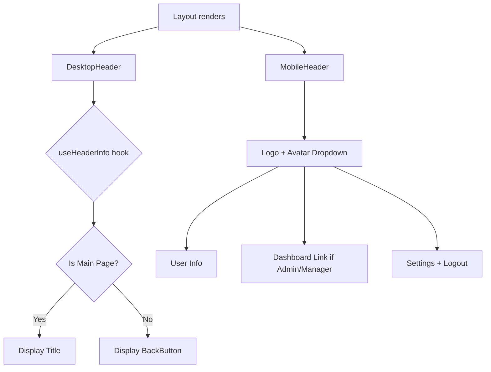

# Design Document: Header Refactor

## Overview

This design refactors the header components across PersonalLayout, DashboardLayout, and TamabeeLayout to use a shared `_layout-header.tsx` component. The new header pattern displays page titles for main pages (level 1) and a back button for sub-pages (level 2+). Mobile header shows logo and avatar dropdown. Toggle theme and BreadcrumbRouter are removed from headers.

## Architecture

### Component Hierarchy

```
_components/_base/
├── _layout-header.tsx      # Shared header (DesktopHeader, MobileHeader)
├── _back-button.tsx        # Back button component (existing)
└── ...

(PersonalLayout)/
├── layout.tsx              # Uses shared _layout-header
└── _components/
    └── _sidebar-config.tsx # Sidebar configuration

(DashboardLayout)/
├── layout.tsx              # Uses shared _layout-header
└── ...

(TamabeeLayout)/
├── layout.tsx              # Uses shared _layout-header
└── ...
```

### Header Flow



## Components and Interfaces

### LayoutHeaderProps Interface

```typescript
interface HeaderConfig {
  // Map of pathname to title translation key
  mainPages: Record<string, string>;
  // Translation namespace for titles
  namespace: string;
}

interface LayoutHeaderProps {
  config: HeaderConfig;
}
```

### useHeaderInfo Hook

```typescript
interface HeaderInfo {
  title: string;
  showBackButton: boolean;
}

function useHeaderInfo(config: HeaderConfig): HeaderInfo {
  const pathname = usePathname();
  const t = useTranslations(config.namespace);

  // Remove locale prefix from pathname
  const pathWithoutLocale = pathname.replace(/^\/[a-z]{2}\//, "/");

  // Check if current path is a main page
  const titleKey = config.mainPages[pathWithoutLocale];

  if (titleKey) {
    return {
      title: t(titleKey),
      showBackButton: false,
    };
  }

  return {
    title: "",
    showBackButton: true,
  };
}
```

### DesktopHeader Component

```typescript
interface DesktopHeaderProps {
  config: HeaderConfig;
}

function DesktopHeader({ config }: DesktopHeaderProps) {
  const { title, showBackButton } = useHeaderInfo(config);

  return (
    <div className="sticky top-0 z-10 hidden md:flex items-center w-full bg-primary-foreground border-b border-primary/20 h-[50px] px-4">
      <SidebarTrigger size="icon-lg" className="relative right-2" />
      <Separator orientation="vertical" className="mr-3 data-[orientation=vertical]:h-4" />
      {showBackButton ? (
        <BackButton />
      ) : (
        <h1 className="text-lg font-semibold">{title}</h1>
      )}
    </div>
  );
}
```

### MobileHeader Component

```typescript
function MobileHeader() {
  const { user, logout } = useAuth();
  const router = useRouter();
  const locale = useLocale();
  const t = useTranslations("header");
  const tEnums = useTranslations("enums");
  const tAuth = useTranslations("auth");
  const [settingsOpen, setSettingsOpen] = useState(false);

  const canAccessDashboard = user?.role?.includes("ADMIN") || user?.role?.includes("MANAGER");

  const handleLogout = async () => {
    await logout();
    router.push("/");
    toast.success(tAuth("logoutSuccess"));
  };

  return (
    <>
      <div className="sticky top-0 z-10 flex md:hidden items-center justify-between w-full bg-white/80 dark:bg-[#222]/80 backdrop-blur-sm border-b border-gray-100 dark:border-gray-800 h-[50px] px-4">
        <Link href={`/${locale}/me`}>
          <LogoFull />
        </Link>
        <DropdownMenu>
          {/* Avatar trigger and dropdown content */}
        </DropdownMenu>
      </div>
      <SidebarSettingsDialog open={settingsOpen} onOpenChange={setSettingsOpen} user={user} />
    </>
  );
}
```

### Header Configuration by Layout

#### PersonalLayout Config

```typescript
const personalHeaderConfig: HeaderConfig = {
  namespace: "portal",
  mainPages: {
    "/me": "home.title",
    "/me/schedule": "schedule.title",
    "/me/leave": "leave.title",
    "/me/payroll": "payroll.title",
    "/me/profile": "profile.title",
    "/me/contract": "contract.title",
    "/me/documents": "documents.title",
    "/me/attendance": "attendance.title",
    "/me/adjustments": "adjustments.title",
    "/me/commissions": "commissions.title",
  },
};
```

#### DashboardLayout Config

```typescript
const dashboardHeaderConfig: HeaderConfig = {
  namespace: "dashboard",
  mainPages: {
    "/dashboard": "home.title",
    "/dashboard/employees": "employees.title",
    "/dashboard/attendance": "attendance.title",
    "/dashboard/payroll": "payroll.title",
    "/dashboard/settings": "settings.title",
    "/dashboard/leaves": "leaves.title",
    "/dashboard/contracts": "contracts.title",
    "/dashboard/shifts": "shifts.title",
    "/dashboard/holidays": "holidays.title",
    "/dashboard/departments": "departments.title",
    "/dashboard/adjustments": "adjustments.title",
    "/dashboard/reports": "reports.title",
    "/dashboard/profile": "profile.title",
    "/dashboard/wallet": "wallet.title",
    "/dashboard/plans": "plans.title",
    "/dashboard/support": "support.title",
    "/dashboard/payslip": "payslip.title",
  },
};
```

#### TamabeeLayout Config

```typescript
const tamabeeHeaderConfig: HeaderConfig = {
  namespace: "admin",
  mainPages: {
    "/admin": "dashboard.title",
    "/admin/companies": "companies.title",
    "/admin/deposits": "deposits.title",
    "/admin/plans": "plans.title",
    "/admin/settings": "settings.title",
    "/admin/billing": "billing.title",
    "/admin/schedulers": "schedulers.title",
  },
};
```

## Data Models

### Translation Keys Structure

```json
// messages/vi/portal.json
{
  "home": { "title": "Trang chủ" },
  "schedule": { "title": "Lịch làm việc" },
  "leave": { "title": "Nghỉ phép" },
  "payroll": { "title": "Bảng lương" },
  "profile": { "title": "Hồ sơ cá nhân" },
  "contract": { "title": "Hợp đồng" },
  "documents": { "title": "Tài liệu" },
  "attendance": { "title": "Chấm công" },
  "adjustments": { "title": "Điều chỉnh" },
  "commissions": { "title": "Hoa hồng" }
}

// messages/vi/dashboard.json
{
  "home": { "title": "Tổng quan" },
  "employees": { "title": "Nhân viên" },
  "attendance": { "title": "Chấm công" },
  "payroll": { "title": "Bảng lương" },
  "settings": { "title": "Cài đặt" },
  // ... other titles
}

// messages/vi/admin.json
{
  "dashboard": { "title": "Tổng quan" },
  "companies": { "title": "Công ty" },
  "deposits": { "title": "Nạp tiền" },
  "plans": { "title": "Gói dịch vụ" },
  "settings": { "title": "Cài đặt" },
  // ... other titles
}

// messages/vi/common.json
{
  "back": "Quay lại"
}

// messages/vi/header.json
{
  "settings": "Cài đặt",
  "logout": "Đăng xuất",
  "menu": {
    "dashboard": "Quản lý"
  }
}
```

## Correctness Properties

_A property is a characteristic or behavior that should hold true across all valid executions of a system—essentially, a formal statement about what the system should do. Properties serve as the bridge between human-readable specifications and machine-verifiable correctness guarantees._

### Property 1: Main Page Title Display

_For any_ pathname that exists in the header config's mainPages map, the DesktopHeader SHALL display the corresponding translated title text (not a back button).

**Validates: Requirements 2.1, 5.3, 6.4, 7.4**

### Property 2: Sub-Page Back Button Display

_For any_ pathname that does NOT exist in the header config's mainPages map, the DesktopHeader SHALL display a BackButton component (not a title).

**Validates: Requirements 2.2, 5.4, 6.5, 7.5**

### Property 3: Admin/Manager Dashboard Link Visibility

_For any_ user with a role containing "ADMIN" or "MANAGER", the MobileHeader's Avatar*Dropdown SHALL include a link to the dashboard. \_For any* user without such roles, the dashboard link SHALL NOT be displayed.

**Validates: Requirements 3.4**

### Property 4: Translation Key Retrieval

_For any_ title key defined in the header config's mainPages map, calling the translation function with that key SHALL return a non-empty string from the configured namespace.

**Validates: Requirements 9.2**

## Error Handling

### Missing Translation Keys

- If a translation key is missing, next-intl will display the key itself as fallback
- During development, missing keys should be logged as warnings
- All required translation keys must be added to vi.json, en.json, and ja.json

### Invalid Pathname

- If pathname is null or undefined, useHeaderInfo should default to showing back button
- The hook should handle edge cases like trailing slashes gracefully

### User Not Authenticated

- MobileHeader should handle null user gracefully
- Avatar should show fallback initial if user profile is incomplete

## Testing Strategy

### Unit Tests

Unit tests should cover specific examples and edge cases:

1. **DesktopHeader rendering**
   - Renders SidebarTrigger
   - Does not render ToggleTheme
   - Has correct CSS classes (sticky, z-10, h-[50px], border-b)

2. **MobileHeader rendering**
   - Renders LogoFull
   - Renders Avatar with dropdown
   - Has md:hidden class for responsive hiding

3. **BackButton behavior**
   - Renders chevron-left icon
   - Renders localized "back" text
   - Calls router.back() on click

4. **Layout integration**
   - PersonalLayout uses shared header
   - DashboardLayout uses shared header without BreadcrumbRouter
   - TamabeeLayout uses shared header without BreadcrumbRouter

### Property-Based Tests

Property tests should verify universal properties across all inputs:

1. **Property 1 Test**: Main Page Title Display
   - Generate random main page paths from config
   - Verify title is displayed for each path
   - Minimum 100 iterations
   - **Feature: header-refactor, Property 1: Main page title display**

2. **Property 2 Test**: Sub-Page Back Button Display
   - Generate random sub-page paths (paths not in config)
   - Verify back button is displayed for each path
   - Minimum 100 iterations
   - **Feature: header-refactor, Property 2: Sub-page back button display**

3. **Property 3 Test**: Admin/Manager Dashboard Link Visibility
   - Generate random user roles
   - Verify dashboard link visibility matches role check
   - Minimum 100 iterations
   - **Feature: header-refactor, Property 3: Admin/Manager dashboard link visibility**

4. **Property 4 Test**: Translation Key Retrieval
   - Generate all title keys from config
   - Verify each key returns non-empty translation
   - Minimum 100 iterations
   - **Feature: header-refactor, Property 4: Translation key retrieval**

### Testing Framework

- Use Jest with React Testing Library for component tests
- Use @testing-library/react for rendering and querying
- Mock next/navigation for router.back() testing
- Mock next-intl for translation testing
