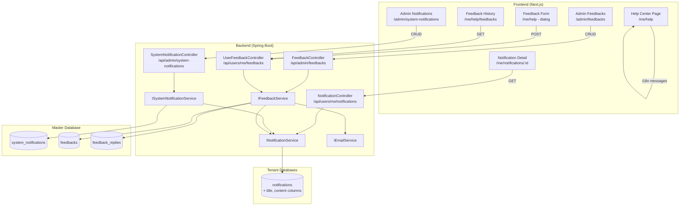

# Design Document: Help Center, System Notification & Feedback

## Overview

Feature này gồm 3 module:

1. **Help Center** — Frontend-only, nội dung tĩnh qua i18n, hiển thị theo role. Không cần backend API.
2. **System Notification (mở rộng)** — Mở rộng hệ thống notification hiện có bằng cách thêm trường `title` và `content` (Markdown) vào `notifications` table. Tamabee Admin/Manager tạo thông báo hệ thống, hệ thống gửi notification cross-tenant. Bao gồm trang Notification Detail để render Markdown và thông báo chào mừng kèm hướng dẫn.
3. **Feedback & Support** — Backend lưu feedback tickets + replies trong master DB, frontend form gửi feedback với ảnh đính kèm, Tamabee staff quản lý và phản hồi.

### Quyết định thiết kế chính

- **Không tạo bảng `announcements` riêng** — Mở rộng `notifications` table sẵn có bằng cách thêm `title` và `content` columns. Phân biệt loại thông báo bằng `type` (SYSTEM, WELCOME).
- **Master copy cho quản lý** — Thêm bảng `system_notifications` trong master DB để Tamabee admin quản lý danh sách thông báo đã gửi. Lưu nội dung 3 ngôn ngữ (vi, en, ja). Khi gửi, chọn ngôn ngữ phù hợp với locale của từng user và copy vào `notifications` table của tenant.
- **Welcome notification = frontend-only** — Thông báo chào mừng không lưu content vào DB. Sử dụng `code` + `params` pattern hiện có (WELCOME_COMPANY, WELCOME_EMPLOYEE). Trang Notification Detail render nội dung rich từ i18n templates trên frontend, giúp dễ dàng chuyển đổi ngôn ngữ.
- Help Center dùng i18n messages thay vì DB vì nội dung ít thay đổi, cần đa ngôn ngữ, và không cần CMS.
- Markdown được chọn cho system notification content vì cân bằng giữa đơn giản (dễ viết) và linh hoạt (style tùy chỉnh).
- Feedback form dùng plain text (không Markdown) vì khách hàng không quen Markdown.
- Feedback + system_notifications dùng master DB vì cần cross-tenant access.

## Architecture



## Components and Interfaces

### Backend Components

#### 1. SystemNotificationController (`/api/admin/system-notifications`)

- `POST /` — Tạo system notification mới và gửi đến target audience cross-tenant
- `GET /` — Lấy danh sách system notifications đã gửi (phân trang)
- `GET /{id}` — Lấy chi tiết system notification (nội dung 3 ngôn ngữ)
- Quyền POST/GET list: `@PreAuthorize("hasAnyRole('ADMIN_TAMABEE', 'MANAGER_TAMABEE')")`
- Quyền GET detail: `@PreAuthorize("isAuthenticated()")` — user cần fetch nội dung đa ngôn ngữ khi xem notification detail

#### 2. Mở rộng NotificationController (`/api/users/me/notifications`)

- `GET /{id}` — **MỚI** — Lấy chi tiết một notification (bao gồm title + content Markdown)
- Các endpoint hiện có giữ nguyên

#### 3. FeedbackController (`/api/admin/feedbacks`)

- `GET /` — Lấy danh sách feedbacks (phân trang, lọc theo status/type)
- `GET /{id}` — Lấy chi tiết feedback + replies
- `POST /{id}/replies` — Gửi phản hồi cho feedback
- `PUT /{id}/status` — Cập nhật trạng thái feedback
- Quyền: `@PreAuthorize("hasAnyRole('ADMIN_TAMABEE', 'MANAGER_TAMABEE', 'EMPLOYEE_TAMABEE')")`

#### 4. UserFeedbackController (`/api/users/me/feedbacks`)

- `POST /` — Gửi feedback mới (multipart form với ảnh đính kèm)
- `GET /` — Lấy danh sách feedback của user hiện tại (phân trang)
- `GET /{id}` — Lấy chi tiết feedback + replies của user
- Quyền: `@PreAuthorize("isAuthenticated()")`

#### 5. ISystemNotificationService

```java
public interface ISystemNotificationService {
    SystemNotificationResponse create(CreateSystemNotificationRequest request,
                                      Long createdByUserId, String createdByName);
    Page<SystemNotificationResponse> getAll(Pageable pageable);
    SystemNotificationResponse getById(Long id);
}
```

#### 6. IFeedbackService

```java
public interface IFeedbackService {
    FeedbackResponse create(CreateFeedbackRequest request, String tenantDomain,
                           Long userId, String userName, String userEmail, String companyName);
    Page<FeedbackResponse> getByUser(Long userId, String tenantDomain, Pageable pageable);
    FeedbackDetailResponse getByIdForUser(Long id, Long userId, String tenantDomain);
    Page<FeedbackResponse> getAll(FeedbackStatus status, FeedbackType type, Pageable pageable);
    FeedbackDetailResponse getById(Long id);
    FeedbackReplyResponse reply(Long feedbackId, CreateFeedbackReplyRequest request,
                                Long repliedByUserId, String repliedByName);
    FeedbackResponse updateStatus(Long id, FeedbackStatus status);
}
```

### Frontend Components

#### Help Center (`/me/help`)

```
(PersonalLayout)/me/help/
├── page.tsx                    # Server component
├── _help-content.tsx           # Client component chính
├── _help-search.tsx            # Ô tìm kiếm
├── _help-article-list.tsx      # Danh sách articles (accordion)
├── _feedback-dialog.tsx        # Dialog gửi feedback
└── feedbacks/
    ├── page.tsx                # Lịch sử feedback
    ├── _feedback-list.tsx      # Danh sách feedback user
    └── [id]/
        ├── page.tsx            # Chi tiết feedback
        └── _feedback-detail.tsx
```

#### Notification Detail (`/me/notifications/[id]`)

```
(PersonalLayout)/me/notifications/
├── [id]/
│   ├── page.tsx                # Server component
│   └── _notification-detail.tsx # Client component render Markdown
```

#### Admin System Notifications (`/admin/system-notifications`)

```
(TamabeeLayout)/admin/system-notifications/
├── page.tsx
├── _notification-table.tsx     # Danh sách system notifications
├── _notification-dialog.tsx    # Dialog tạo notification mới
└── [id]/
    ├── page.tsx
    └── _notification-detail.tsx # Chi tiết (Markdown render)
```

#### Admin Feedbacks (`/admin/feedbacks`)

```
(TamabeeLayout)/admin/feedbacks/
├── page.tsx
├── _feedback-table.tsx         # Danh sách feedbacks
└── [id]/
    ├── page.tsx
    └── _feedback-detail.tsx    # Chi tiết + reply form
```

### Help Center Data Structure (i18n)

Nội dung Help Center được tổ chức trong file `messages/{locale}/help.json`:

```typescript
interface HelpTopic {
  key: string; // Unique key (e.g., "attendance", "leave")
  icon: string; // Lucide icon name
  roles: RoleGroup[]; // Roles có thể xem topic này
  articles: HelpArticle[];
}

interface HelpArticle {
  key: string; // Unique key
  roles: RoleGroup[]; // Roles có thể xem article này
}

type RoleGroup = "employee" | "company_admin" | "tamabee_staff";
```

Cấu trúc topic/article metadata được định nghĩa trong `constants/help-center.ts`, nội dung text trong i18n messages.

### Markdown Renderer Component

Component dùng chung cho cả Notification Detail và System Notification Detail:

```typescript
// _components/_shared/_markdown-renderer.tsx
interface MarkdownRendererProps {
  content: string;
  className?: string;
}
```

Sử dụng `react-markdown` với `@tailwindcss/typography` (prose class). Custom link renderer để xử lý internal navigation qua `router.push()`.

## Data Models

### Mở rộng Tenant Database — notifications table

Thêm 2 cột mới vào bảng `notifications` hiện có:

```sql
-- Thêm vào V1__init.sql (cập nhật trực tiếp)
ALTER TABLE notifications ADD COLUMN title VARCHAR(255);
ALTER TABLE notifications ADD COLUMN content TEXT;
ALTER TABLE notifications ADD COLUMN system_notification_id BIGINT;
```

- `title`: Tiêu đề thông báo (dùng cho hiển thị trong danh sách notification). Lưu theo locale của user tại thời điểm gửi.
- `content`: Nội dung Markdown chi tiết. NULL cho notifications thông thường.
- `system_notification_id`: ID tham chiếu đến `system_notifications` table trong master DB. Khi có giá trị, trang Notification Detail sẽ fetch nội dung từ master DB theo locale hiện tại của user → hỗ trợ chuyển ngôn ngữ.

**Cách xử lý chuyển ngôn ngữ:**

- Notification list: hiển thị `title` đã lưu trong tenant DB (ngôn ngữ tại thời điểm gửi) — đủ tốt cho danh sách
- Notification Detail: nếu có `system_notification_id` → gọi API `GET /api/system-notifications/{id}` để lấy nội dung 3 ngôn ngữ, frontend chọn theo locale hiện tại → chuyển ngôn ngữ mượt mà
- Nếu không có `system_notification_id` (notification thường) → hoạt động như cũ (dùng code + params)

### Master Database — system_notifications table

Bảng lưu master copy của các thông báo hệ thống do Tamabee tạo, lưu nội dung 3 ngôn ngữ:

```sql
CREATE TABLE system_notifications (
    id BIGSERIAL PRIMARY KEY,
    title_vi VARCHAR(255) NOT NULL,
    title_en VARCHAR(255) NOT NULL,
    title_ja VARCHAR(255) NOT NULL,
    content_vi TEXT NOT NULL,
    content_en TEXT NOT NULL,
    content_ja TEXT NOT NULL,
    target_audience VARCHAR(50) NOT NULL,
    created_by_user_id BIGINT,
    created_by_name VARCHAR(100),
    created_at TIMESTAMP NOT NULL DEFAULT CURRENT_TIMESTAMP,
    updated_at TIMESTAMP NOT NULL DEFAULT CURRENT_TIMESTAMP
);

CREATE INDEX idx_system_notifications_created_at ON system_notifications(created_at DESC);
```

### Master Database — feedbacks table

```sql
CREATE TABLE feedbacks (
    id BIGSERIAL PRIMARY KEY,
    user_id BIGINT NOT NULL,
    tenant_domain VARCHAR(100) NOT NULL,
    user_name VARCHAR(100) NOT NULL,
    user_email VARCHAR(255) NOT NULL,
    company_name VARCHAR(255),
    type VARCHAR(50) NOT NULL,
    title VARCHAR(255) NOT NULL,
    description TEXT NOT NULL,
    attachment_urls TEXT,
    status VARCHAR(50) NOT NULL DEFAULT 'OPEN',
    created_at TIMESTAMP NOT NULL DEFAULT CURRENT_TIMESTAMP,
    updated_at TIMESTAMP NOT NULL DEFAULT CURRENT_TIMESTAMP
);

CREATE INDEX idx_feedbacks_status ON feedbacks(status);
CREATE INDEX idx_feedbacks_type ON feedbacks(type);
CREATE INDEX idx_feedbacks_tenant_user ON feedbacks(tenant_domain, user_id);
CREATE INDEX idx_feedbacks_created_at ON feedbacks(created_at DESC);
```

### Master Database — feedback_replies table

```sql
CREATE TABLE feedback_replies (
    id BIGSERIAL PRIMARY KEY,
    feedback_id BIGINT NOT NULL REFERENCES feedbacks(id) ON DELETE CASCADE,
    replied_by_user_id BIGINT NOT NULL,
    replied_by_name VARCHAR(100) NOT NULL,
    content TEXT NOT NULL,
    created_at TIMESTAMP NOT NULL DEFAULT CURRENT_TIMESTAMP,
    updated_at TIMESTAMP NOT NULL DEFAULT CURRENT_TIMESTAMP
);

CREATE INDEX idx_feedback_replies_feedback_id ON feedback_replies(feedback_id);
```

### Backend Entities

#### Mở rộng NotificationEntity (tenant DB)

```java
// Thêm 3 trường vào NotificationEntity hiện có
@Column(length = 255)
private String title;

@Column(columnDefinition = "TEXT")
private String content;

@Column(name = "system_notification_id")
private Long systemNotificationId;
```

#### SystemNotificationEntity (master DB, không soft delete)

```java
@Entity
@Table(name = "system_notifications")
public class SystemNotificationEntity extends BaseEntity {
    @Column(name = "title_vi", nullable = false, length = 255)
    private String titleVi;

    @Column(name = "title_en", nullable = false, length = 255)
    private String titleEn;

    @Column(name = "title_ja", nullable = false, length = 255)
    private String titleJa;

    @Column(name = "content_vi", nullable = false, columnDefinition = "TEXT")
    private String contentVi;

    @Column(name = "content_en", nullable = false, columnDefinition = "TEXT")
    private String contentEn;

    @Column(name = "content_ja", nullable = false, columnDefinition = "TEXT")
    private String contentJa;

    @Enumerated(EnumType.STRING)
    @Column(name = "target_audience", nullable = false, length = 50)
    private TargetAudience targetAudience;

    @Column(name = "created_by_user_id")
    private Long createdByUserId;

    @Column(name = "created_by_name", length = 100)
    private String createdByName;
}
```

#### FeedbackEntity (master DB, không soft delete)

```java
@Entity
@Table(name = "feedbacks")
public class FeedbackEntity extends BaseEntity {
    @Column(name = "user_id", nullable = false)
    private Long userId;

    @Column(name = "tenant_domain", nullable = false, length = 100)
    private String tenantDomain;

    @Column(name = "user_name", nullable = false, length = 100)
    private String userName;

    @Column(name = "user_email", nullable = false, length = 255)
    private String userEmail;

    @Column(name = "company_name", length = 255)
    private String companyName;

    @Enumerated(EnumType.STRING)
    @Column(nullable = false, length = 50)
    private FeedbackType type;

    @Column(nullable = false, length = 255)
    private String title;

    @Column(nullable = false, columnDefinition = "TEXT")
    private String description;

    @Column(name = "attachment_urls", columnDefinition = "TEXT")
    private String attachmentUrls;

    @Enumerated(EnumType.STRING)
    @Column(nullable = false, length = 50)
    private FeedbackStatus status = FeedbackStatus.OPEN;
}
```

#### FeedbackReplyEntity (master DB, không soft delete)

```java
@Entity
@Table(name = "feedback_replies")
public class FeedbackReplyEntity extends BaseEntity {
    @Column(name = "feedback_id", nullable = false)
    private Long feedbackId;

    @Column(name = "replied_by_user_id", nullable = false)
    private Long repliedByUserId;

    @Column(name = "replied_by_name", nullable = false, length = 100)
    private String repliedByName;

    @Column(nullable = false, columnDefinition = "TEXT")
    private String content;
}
```

### Enums

```java
public enum TargetAudience {
    COMPANY_ADMINS,
    ALL_USERS
}

public enum FeedbackType {
    BUG_REPORT,
    FEATURE_REQUEST,
    GENERAL_FEEDBACK,
    SUPPORT_REQUEST
}

public enum FeedbackStatus {
    OPEN,
    IN_PROGRESS,
    RESOLVED,
    CLOSED
}
```

### Notification Codes mới

```java
// Thêm vào NotificationCode.java
public static final String FEEDBACK_SUBMITTED = "FEEDBACK_SUBMITTED";
public static final String FEEDBACK_REPLIED = "FEEDBACK_REPLIED";
```

### Mở rộng NotificationType

```java
// Thêm vào NotificationType.java
FEEDBACK    // Thông báo feedback/góp ý
```

### Mở rộng NotificationResponse

```java
// Thêm 3 trường vào NotificationResponse hiện có
private String title;
private String content;
private Long systemNotificationId;
```

### Frontend Types

```typescript
// types/feedback.ts
interface Feedback {
  id: number;
  userId: number;
  tenantDomain: string;
  userName: string;
  userEmail: string;
  companyName: string | null;
  type: FeedbackType;
  title: string;
  description: string;
  attachmentUrls: string[];
  status: FeedbackStatus;
  createdAt: string;
}

interface FeedbackReply {
  id: number;
  feedbackId: number;
  repliedByUserId: number;
  repliedByName: string;
  content: string;
  createdAt: string;
}

interface FeedbackDetail extends Feedback {
  replies: FeedbackReply[];
}

type FeedbackType =
  | "BUG_REPORT"
  | "FEATURE_REQUEST"
  | "GENERAL_FEEDBACK"
  | "SUPPORT_REQUEST";
type FeedbackStatus = "OPEN" | "IN_PROGRESS" | "RESOLVED" | "CLOSED";

// types/system-notification.ts
interface SystemNotification {
  id: number;
  titleVi: string;
  titleEn: string;
  titleJa: string;
  contentVi: string;
  contentEn: string;
  contentJa: string;
  targetAudience: TargetAudience;
  createdByName: string | null;
  createdAt: string;
}

type TargetAudience = "COMPANY_ADMINS" | "ALL_USERS";

// Mở rộng Notification type hiện có
// types/notification.ts — thêm 3 trường optional
interface Notification {
  // ... existing fields
  title?: string; // Tiêu đề (theo locale tại thời điểm gửi)
  content?: string; // Markdown content
  systemNotificationId?: number; // Ref đến master DB, fetch nội dung đa ngôn ngữ
}
```

### Luồng gửi System Notification

Tham khảo pattern đã ổn định trong `NotificationServiceImpl.notifyTamabeeStaff()` và `DepositRequestServiceImpl.notifyRequesterOnDepositApproved()`:

1. Tamabee Admin tạo notification mới (title_vi/en/ja, content_vi/en/ja Markdown, target_audience)
2. Backend lưu master copy vào `system_notifications` table (master DB) — dùng Repository bình thường vì đây là master DB entity
3. Backend lặp qua tất cả tenant bằng `TenantDataSourceManager.getDataSource(tenantDomain)`:
   - Tạo `JdbcTemplate` cho mỗi tenant (pattern giống `notifyTamabeeStaff`)
   - Query users theo target_audience:
     - `COMPANY_ADMINS` → `SELECT id, language FROM users WHERE role = 'ADMIN_COMPANY' AND deleted = false`
     - `ALL_USERS` → `SELECT id, language FROM users WHERE deleted = false AND status = 'ACTIVE'`
4. Với mỗi user, lấy `language` column, chọn title/content tương ứng (vi/en/ja)
5. Insert notification bằng JDBC (pattern giống `insertNotificationWithJdbc` hiện có) với thêm `title`, `content`, `system_notification_id`
6. Push WebSocket real-time cho mỗi user (pattern giống `pushNotification` hiện có)

**Lưu ý quan trọng:**

- KHÔNG dùng Repository cho cross-tenant operations — luôn dùng `JdbcTemplate` với `DataSource` từ `TenantDataSourceManager`
- KHÔNG switch `TenantContext` — tạo `JdbcTemplate` riêng cho mỗi tenant
- Wrap trong try-catch để lỗi 1 tenant không ảnh hưởng tenant khác

### Luồng Welcome Notification (Frontend-only content)

Welcome notification **không lưu content vào DB**. Thay vào đó:

1. Khi tạo company/employee mới (trong AuthServiceImpl/CompanyEmployeeServiceImpl)
2. Tạo notification bình thường với `code=WELCOME_COMPANY/WELCOME_EMPLOYEE`, `type=WELCOME`, `targetUrl=/me/notifications/{id}`
3. **Không cần** `title` và `content` trong DB — giữ NULL
4. Trang Notification Detail kiểm tra: nếu notification có `code` là WELCOME_COMPANY hoặc WELCOME_EMPLOYEE → render nội dung rich từ i18n template (`messages/{locale}/help.json`) thay vì từ DB
5. Lợi ích: nội dung chào mừng tự động chuyển ngôn ngữ khi user đổi locale, không cần lưu nhiều bản ngôn ngữ trong DB

## Correctness Properties

_A property is a characteristic or behavior that should hold true across all valid executions of a system — essentially, a formal statement about what the system should do. Properties serve as the bridge between human-readable specifications and machine-verifiable correctness guarantees._

### Property 1: Role-based content filtering

_For any_ user role và bất kỳ tập hợp topics/articles nào, hàm lọc nội dung theo role chỉ trả về các topics và articles có tag role_group tương ứng hoặc role_group cấp thấp hơn (employee ⊂ company_admin ⊂ tamabee_staff).
**Validates: Requirements 3.1, 3.2, 3.3, 3.4, 3.5**

### Property 2: Search returns matching articles with topic info

_For any_ từ khóa tìm kiếm và bất kỳ tập hợp articles nào, kết quả tìm kiếm chỉ chứa các articles có tiêu đề hoặc nội dung chứa từ khóa đó (case-insensitive), và mỗi article trong kết quả đều kèm tên Topic tương ứng.
**Validates: Requirements 4.2, 4.3**

### Property 3: System notification sends to correct audience

_For any_ system notification với target_audience xác định, khi gửi thì tất cả user thuộc target audience trên tất cả tenant đều nhận được notification với title, content, và targetUrl trỏ đến trang Notification Detail.
**Validates: Requirements 8.3, 8.5, 8.6**

### Property 4: Markdown rendering with internal link handling

_For any_ chuỗi Markdown hợp lệ, Markdown renderer tạo ra HTML output. Với bất kỳ link nào trong Markdown có href bắt đầu bằng `/me/` hoặc `/dashboard/`, link đó được render dưới dạng internal navigation thay vì anchor tag thông thường.
**Validates: Requirements 9.3, 9.4**

### Property 5: Welcome notification uses frontend-only content

_For any_ notification với code WELCOME_COMPANY hoặc WELCOME_EMPLOYEE, trang Notification Detail render nội dung rich từ i18n template theo locale hiện tại của user, không phụ thuộc vào trường title/content trong DB.
**Validates: Requirements 10.1, 10.2, 10.4**

### Property 6: System notification content matches user locale

_For any_ system notification được gửi đến user với locale xác định (vi, en, ja), trường title và content trong notification record của user chứa nội dung đúng ngôn ngữ tương ứng từ system_notifications master copy.
**Validates: Requirements 8.3, 10.4**

### Property 7: Feedback creation persists correctly

_For any_ feedback submission từ authenticated user, Feedback_Entity được lưu với đầy đủ thông tin user (userId, email, tên, company từ JWT), status = OPEN, và tất cả trường bắt buộc.
**Validates: Requirements 12.3, 12.4, 12.6**

### Property 8: Feedback submission notifies all Tamabee staff

_For any_ feedback được gửi thành công, tất cả nhân viên Tamabee (ADMIN_TAMABEE, MANAGER_TAMABEE, EMPLOYEE_TAMABEE) đều nhận được notification real-time.
**Validates: Requirements 12.5**

### Property 9: Reply creation notifies feedback sender

_For any_ phản hồi từ nhân viên Tamabee cho một feedback, Feedback_Reply được lưu kèm thông tin người phản hồi (repliedByUserId, repliedByName), và người gửi feedback ban đầu nhận được notification.
**Validates: Requirements 13.4, 13.8, 14.4**

### Property 10: Feedback status transitions are valid

_For any_ cập nhật trạng thái feedback, chỉ các transition hợp lệ được chấp nhận: OPEN → IN_PROGRESS, IN_PROGRESS → RESOLVED, RESOLVED → CLOSED, và bất kỳ trạng thái nào → CLOSED.
**Validates: Requirements 13.5**

### Property 11: Feedback filtering returns correct results

_For any_ tổ hợp filter (status, type), danh sách feedback trả về chỉ chứa các feedback có status và type khớp với filter đã chọn.
**Validates: Requirements 13.6**

### Property 12: User feedback listing returns only own feedbacks

_For any_ user, API lấy danh sách feedback chỉ trả về các feedback có userId và tenantDomain khớp với user hiện tại, không bao giờ trả về feedback của user khác.
**Validates: Requirements 14.1**

### Property 13: Pagination returns correct page of results

_For any_ request phân trang với page number và page size, kết quả trả về có số lượng items không vượt quá page size, và tổng số trang tính đúng dựa trên tổng số items.
**Validates: Requirements 11.4, 13.7**

## Error Handling

### Backend

| Tình huống                                | ErrorCode                     | HTTP Status |
| ----------------------------------------- | ----------------------------- | ----------- |
| System notification không tồn tại         | SYSTEM_NOTIFICATION_NOT_FOUND | 404         |
| Notification không tồn tại                | NOTIFICATION_NOT_FOUND        | 404         |
| Feedback không tồn tại                    | FEEDBACK_NOT_FOUND            | 404         |
| Feedback không thuộc user hiện tại        | FORBIDDEN                     | 403         |
| Status transition không hợp lệ            | INVALID_STATUS_TRANSITION     | 400         |
| Thiếu trường bắt buộc trong form          | VALIDATION_ERROR              | 400         |
| File upload vượt quá giới hạn             | FILE_TOO_LARGE                | 400         |
| Loại file không hợp lệ (chỉ cho phép ảnh) | INVALID_FILE_TYPE             | 400         |

### Frontend

- Sử dụng `getErrorMessage(errorCode, tErrors)` để dịch error codes
- Toast notification cho lỗi API
- Empty state components cho danh sách rỗng
- Loading skeleton cho trạng thái đang tải
- Fallback về Role_Group "Employee" khi role không xác định

## Testing Strategy

### Unit Tests

- Test hàm lọc topics/articles theo role
- Test hàm tìm kiếm articles theo keyword
- Test status transition validation
- Test Markdown renderer output
- Test feedback entity creation với đầy đủ fields

### Property-Based Tests

- Sử dụng thư viện: **jqwik** (Java) cho backend, **fast-check** (TypeScript) cho frontend
- Mỗi property test chạy tối thiểu 100 iterations
- Mỗi test được annotate với property number từ design document
- Tag format: **Feature: help-center, Property {number}: {property_text}**

Dual testing approach:

- Unit tests: kiểm tra các ví dụ cụ thể, edge cases, error conditions
- Property tests: kiểm tra các thuộc tính phổ quát trên nhiều inputs ngẫu nhiên
- Cả hai bổ sung cho nhau để đảm bảo coverage toàn diện
