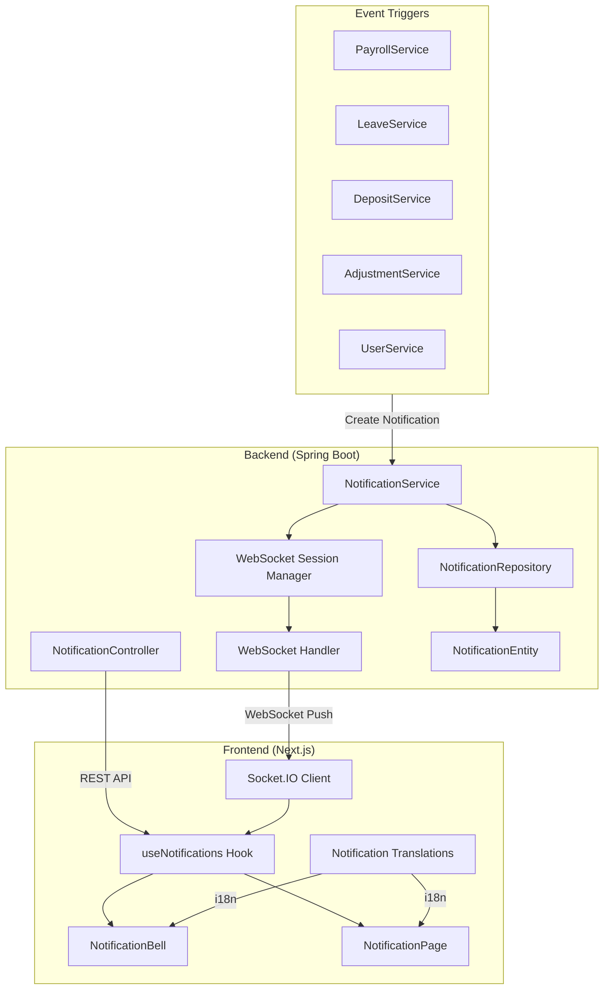

# Design Document: Real-Time Notification System

## Overview

This design document describes the architecture and implementation of a real-time notification system for Tamabee HR. The system follows a code-based approach where notification types are stored as codes (not text) to support i18n translation on the frontend. Real-time delivery is achieved through WebSocket (Spring WebSocket on backend, Socket.IO on frontend) with automatic reconnection.

The system integrates with existing multi-tenant architecture, storing notifications in tenant databases (per company) while supporting cross-tenant notifications for Tamabee admin operations.

## Architecture



### Key Design Decisions

1. **Code-based notifications**: Store notification codes instead of text to support i18n
2. **WebSocket for real-time**: Use WebSocket for bidirectional communication with automatic reconnection
3. **Socket.IO on frontend**: Provides auto-reconnect, fallback transports, and room support
4. **Spring WebSocket on backend**: Native Spring support with STOMP protocol
5. **Tenant-aware storage**: Notifications stored in tenant DB, following existing multi-tenant pattern
6. **Centralized notification creation**: Services call NotificationService to create notifications

## Components and Interfaces

### Backend Components

#### 1. NotificationEntity (Entity)

```java
@Entity
@Table(name = "notifications")
public class NotificationEntity extends BaseEntity {

    @Column(nullable = false)
    private Long userId;

    @Column(nullable = false, length = 50)
    private String code;  // e.g., "LEAVE_APPROVED", "PAYROLL_PAID"

    @Column(columnDefinition = "TEXT")
    private String params;  // JSON: {"employeeName": "John", "amount": 50000}

    @Column(length = 255)
    private String targetUrl;  // e.g., "/me/leave", "/me/payroll"

    @Enumerated(EnumType.STRING)
    @Column(nullable = false)
    private NotificationType type;

    @Column(nullable = false)
    private Boolean isRead = false;
}
```

#### 2. INotificationService (Interface)

```java
public interface INotificationService {
    // Query operations
    Page<NotificationResponse> getNotifications(Long userId, Pageable pageable);
    Long getUnreadCount(Long userId);

    // Mutation operations
    void markAsRead(Long userId, Long notificationId);
    void markAllAsRead(Long userId);

    // Creation operations (called by other services)
    void createNotification(Long userId, String code, Map<String, Object> params,
                           String targetUrl, NotificationType type);
    void createBulkNotifications(List<Long> userIds, String code, Map<String, Object> params,
                                 String targetUrl, NotificationType type);

    // WebSocket operations
    void pushNotification(Long userId, NotificationResponse notification);
}
```

#### 3. WebSocketConfig (Configuration)

```java
@Configuration
@EnableWebSocketMessageBroker
public class WebSocketConfig implements WebSocketMessageBrokerConfigurer {

    @Override
    public void configureMessageBroker(MessageBrokerRegistry config) {
        config.enableSimpleBroker("/topic", "/queue");
        config.setApplicationDestinationPrefixes("/app");
        config.setUserDestinationPrefix("/user");
    }

    @Override
    public void registerStompEndpoints(StompEndpointRegistry registry) {
        registry.addEndpoint("/ws/notifications")
                .setAllowedOrigins("*")
                .withSockJS();
    }
}
```

#### 4. NotificationController (REST API)

```java
@RestController
@RequestMapping("/api/users/me/notifications")
@PreAuthorize("isAuthenticated()")
public class NotificationController {

    @GetMapping
    Page<NotificationResponse> getNotifications(Pageable pageable);

    @GetMapping("/unread-count")
    Long getUnreadCount();

    @PutMapping("/{id}/read")
    void markAsRead(@PathVariable Long id);

    @PutMapping("/read-all")
    void markAllAsRead();
}
```

### Frontend Components

#### 1. Socket.IO Client Setup

```typescript
// lib/socket.ts
import { io, Socket } from "socket.io-client";

let socket: Socket | null = null;

export function getSocket(token: string): Socket {
  if (!socket) {
    socket = io(process.env.NEXT_PUBLIC_WS_URL || "", {
      auth: { token },
      transports: ["websocket"],
      reconnection: true,
      reconnectionAttempts: Infinity,
      reconnectionDelay: 1000,
      reconnectionDelayMax: 30000,
    });
  }
  return socket;
}

export function disconnectSocket() {
  if (socket) {
    socket.disconnect();
    socket = null;
  }
}
```

#### 2. useNotifications Hook

```typescript
interface UseNotificationsReturn {
  notifications: Notification[];
  unreadCount: number;
  isLoading: boolean;
  markAsRead: (id: number) => Promise<void>;
  markAllAsRead: () => Promise<void>;
  refetch: () => Promise<void>;
}

function useNotifications(): UseNotificationsReturn;
```

#### 2. useNotifications Hook

```typescript
interface UseNotificationsReturn {
  notifications: Notification[];
  unreadCount: number;
  isLoading: boolean;
  isConnected: boolean;
  markAsRead: (id: number) => Promise<void>;
  markAllAsRead: () => Promise<void>;
  refetch: () => Promise<void>;
}

function useNotifications(): UseNotificationsReturn;
```

#### 3. NotificationBell Component

- Displays bell icon with unread badge
- Shows popup with 5 recent notifications on click
- Handles Socket.IO connection for real-time updates
- Auto-reconnect with exponential backoff (unlimited retries)
- On reconnect: fetch latest data via REST API once (no polling)

#### 4. NotificationPage Component

- Full list view at `/me/notifications`
- Pagination support
- "Mark All as Read" button
- Click to navigate and mark as read

## Data Models

### Backend Data Models

#### NotificationEntity

| Field     | Type             | Description                          |
| --------- | ---------------- | ------------------------------------ |
| id        | Long             | Primary key (from BaseEntity)        |
| userId    | Long             | Target user ID                       |
| code      | String(50)       | Notification code for i18n           |
| params    | TEXT (JSON)      | Dynamic parameters for interpolation |
| targetUrl | String(255)      | URL to navigate on click             |
| type      | NotificationType | Category of notification             |
| isRead    | Boolean          | Read status                          |
| createdAt | LocalDateTime    | Creation timestamp (from BaseEntity) |
| updatedAt | LocalDateTime    | Update timestamp (from BaseEntity)   |

#### NotificationType Enum

```java
public enum NotificationType {
    WELCOME,      // Welcome messages
    PAYROLL,      // Payroll-related
    WALLET,       // Deposit, billing
    LEAVE,        // Leave requests
    ADJUSTMENT,   // Attendance adjustments
    SYSTEM        // System announcements
}
```

#### NotificationCode Constants

```java
public class NotificationCode {
    // Welcome
    public static final String WELCOME_COMPANY = "WELCOME_COMPANY";
    public static final String WELCOME_EMPLOYEE = "WELCOME_EMPLOYEE";

    // Payroll
    public static final String PAYROLL_PERIOD_CREATED = "PAYROLL_PERIOD_CREATED";
    public static final String PAYROLL_CONFIRMED = "PAYROLL_CONFIRMED";
    public static final String PAYROLL_PAID = "PAYROLL_PAID";

    // Wallet
    public static final String DEPOSIT_APPROVED = "DEPOSIT_APPROVED";
    public static final String DEPOSIT_REJECTED = "DEPOSIT_REJECTED";
    public static final String LOW_BALANCE_WARNING = "LOW_BALANCE_WARNING";

    // Leave
    public static final String LEAVE_SUBMITTED = "LEAVE_SUBMITTED";
    public static final String LEAVE_APPROVED = "LEAVE_APPROVED";
    public static final String LEAVE_REJECTED = "LEAVE_REJECTED";

    // Adjustment
    public static final String ADJUSTMENT_SUBMITTED = "ADJUSTMENT_SUBMITTED";
    public static final String ADJUSTMENT_APPROVED = "ADJUSTMENT_APPROVED";
    public static final String ADJUSTMENT_REJECTED = "ADJUSTMENT_REJECTED";

    // System
    public static final String SYSTEM_ANNOUNCEMENT = "SYSTEM_ANNOUNCEMENT";
}
```

### Frontend Data Models

#### Notification Type

```typescript
interface Notification {
  id: number;
  code: string;
  params: Record<string, string | number>;
  targetUrl: string;
  type: NotificationType;
  isRead: boolean;
  createdAt: string;
}

type NotificationType =
  | "WELCOME"
  | "PAYROLL"
  | "WALLET"
  | "LEAVE"
  | "ADJUSTMENT"
  | "SYSTEM";
```

### Database Schema (Flyway)

```sql
-- V1__notifications.sql (add to existing V1)
CREATE TABLE notifications (
    id BIGSERIAL PRIMARY KEY,
    user_id BIGINT NOT NULL,
    code VARCHAR(50) NOT NULL,
    params TEXT,
    target_url VARCHAR(255),
    type VARCHAR(20) NOT NULL,
    is_read BOOLEAN NOT NULL DEFAULT FALSE,
    created_at TIMESTAMP NOT NULL DEFAULT CURRENT_TIMESTAMP,
    updated_at TIMESTAMP NOT NULL DEFAULT CURRENT_TIMESTAMP,

    CONSTRAINT fk_notifications_user FOREIGN KEY (user_id) REFERENCES users(id)
);

CREATE INDEX idx_notifications_user_id ON notifications(user_id);
CREATE INDEX idx_notifications_user_read ON notifications(user_id, is_read);
CREATE INDEX idx_notifications_created_at ON notifications(created_at DESC);
```

### i18n Message Structure

```json
// messages/vi/notifications.json
{
  "title": "Thông báo",
  "markAllRead": "Đánh dấu tất cả đã đọc",
  "viewAll": "Xem tất cả",
  "noNotifications": "Không có thông báo",
  "codes": {
    "WELCOME_COMPANY": "Chào mừng {companyName} đến với Tamabee HR!",
    "WELCOME_EMPLOYEE": "Chào mừng bạn đến với {companyName}!",
    "PAYROLL_PERIOD_CREATED": "Kỳ lương {periodName} đã được tạo",
    "PAYROLL_CONFIRMED": "Phiếu lương tháng {month}/{year} đã được xác nhận",
    "PAYROLL_PAID": "Lương tháng {month}/{year} đã được thanh toán",
    "DEPOSIT_APPROVED": "Yêu cầu nạp tiền {amount} đã được duyệt",
    "DEPOSIT_REJECTED": "Yêu cầu nạp tiền {amount} đã bị từ chối",
    "LOW_BALANCE_WARNING": "Số dư ví còn {balance}, vui lòng nạp thêm",
    "LEAVE_SUBMITTED": "{employeeName} đã gửi đơn xin nghỉ phép",
    "LEAVE_APPROVED": "Đơn xin nghỉ phép của bạn đã được duyệt",
    "LEAVE_REJECTED": "Đơn xin nghỉ phép của bạn đã bị từ chối",
    "ADJUSTMENT_SUBMITTED": "{employeeName} đã gửi yêu cầu điều chỉnh chấm công",
    "ADJUSTMENT_APPROVED": "Yêu cầu điều chỉnh chấm công đã được duyệt",
    "ADJUSTMENT_REJECTED": "Yêu cầu điều chỉnh chấm công đã bị từ chối",
    "SYSTEM_ANNOUNCEMENT": "{message}"
  },
  "timeAgo": {
    "justNow": "Vừa xong",
    "minutesAgo": "{count} phút trước",
    "hoursAgo": "{count} giờ trước",
    "daysAgo": "{count} ngày trước"
  }
}
```

## Correctness Properties

_A property is a characteristic or behavior that should hold true across all valid executions of a system—essentially, a formal statement about what the system should do. Properties serve as the bridge between human-readable specifications and machine-verifiable correctness guarantees._

### Property 1: Notification Data Integrity

_For any_ created notification, the notification SHALL have all required fields present and valid: non-empty code matching a known NotificationCode constant, valid JSON in params field (if present), non-null isRead boolean, valid NotificationType enum value, and non-null createdAt timestamp.

**Validates: Requirements 1.1, 1.2, 1.3, 1.4, 1.5, 1.6**

### Property 2: Unread Count Accuracy

_For any_ user with notifications, the unread count returned by the API SHALL equal the actual count of notifications where isRead is false for that user.

**Validates: Requirements 4.2**

### Property 3: Mark As Read State Change

_For any_ notification that is marked as read, the notification's isRead field SHALL change from false to true, and subsequent queries SHALL return isRead as true.

**Validates: Requirements 4.3**

### Property 4: Mark All As Read Bulk Operation

_For any_ user with unread notifications, after calling mark-all-as-read, all notifications for that user SHALL have isRead set to true, and unread count SHALL be zero.

**Validates: Requirements 4.4**

### Property 5: Notification List Ordering

_For any_ paginated list of notifications returned by the API, the notifications SHALL be sorted by createdAt in descending order (newest first).

**Validates: Requirements 4.5**

### Property 6: Badge Display Formatting

_For any_ unread count value, the badge SHALL display: nothing when count is 0, the exact count when 1-99, and "99+" when count exceeds 99.

**Validates: Requirements 6.2, 6.3**

### Property 7: Notification Click Behavior

_For any_ notification click event, the system SHALL mark the notification as read AND navigate to the notification's targetUrl.

**Validates: Requirements 6.6, 7.4, 9.1, 9.2**

### Property 8: Read/Unread Visual Distinction

_For any_ notification displayed in the list, read notifications SHALL have different visual styling (CSS classes) than unread notifications.

**Validates: Requirements 7.5**

### Property 9: Relative Time Formatting

_For any_ notification timestamp, the formatRelativeTime function SHALL return appropriate relative time strings: "just now" for < 1 minute, "X minutes ago" for < 1 hour, "X hours ago" for < 24 hours, "X days ago" for >= 24 hours.

**Validates: Requirements 7.6**

### Property 10: Translation with Parameter Interpolation

_For any_ notification code and locale combination, the translation function SHALL return a non-empty string with all parameter placeholders replaced by actual values from the params object.

**Validates: Requirements 8.1, 8.2, 8.3, 8.4**

### Property 11: Request Submission Notifications

_For any_ leave request or adjustment request submission, notifications SHALL be created for all users with ADMIN_COMPANY or MANAGER_COMPANY role in the same company.

**Validates: Requirements 3.3, 3.5**

### Property 12: Request Response Notifications

_For any_ leave request or adjustment request that is approved or rejected, a notification SHALL be created for the user who originally submitted the request.

**Validates: Requirements 3.4, 3.6**

### Property 13: WebSocket Push on Notification Creation

_For any_ notification created for a user with an active WebSocket connection, the notification SHALL be pushed through the WebSocket to that user.

**Validates: Requirements 5.2**

### Property 14: Fallback URL Handling

_For any_ notification click where the targetUrl is null, empty, or invalid, the system SHALL redirect to the notification list page (/me/notifications) instead.

**Validates: Requirements 9.3**

## Error Handling

### Backend Error Handling

| Error Scenario                         | Error Code             | HTTP Status | Handling                                     |
| -------------------------------------- | ---------------------- | ----------- | -------------------------------------------- |
| Notification not found                 | NOTIFICATION_NOT_FOUND | 404         | Return error response                        |
| Notification belongs to different user | FORBIDDEN              | 403         | Prevent access to other users' notifications |
| Invalid notification ID format         | BAD_REQUEST            | 400         | Validate ID parameter                        |
| SSE connection timeout                 | -                      | -           | Close emitter gracefully                     |
| Database connection error              | INTERNAL_SERVER_ERROR  | 500         | Log error, return generic message            |

### Frontend Error Handling

| Error Scenario            | Handling                                                        |
| ------------------------- | --------------------------------------------------------------- |
| API request fails         | Show toast error, retry once                                    |
| WebSocket connection lost | Auto-reconnect with exponential backoff (unlimited retries)     |
| WebSocket reconnects      | Fetch latest unread count and recent notifications via API once |
| Translation key not found | Return notification code as fallback                            |
| Invalid targetUrl         | Redirect to /me/notifications                                   |
| Network offline           | Show cached notifications, queue mark-as-read operations        |

### WebSocket Connection Management

```java
// WebSocket configuration
@Configuration
@EnableWebSocketMessageBroker
public class WebSocketConfig implements WebSocketMessageBrokerConfigurer {

    @Override
    public void configureMessageBroker(MessageBrokerRegistry config) {
        config.enableSimpleBroker("/topic", "/queue");
        config.setApplicationDestinationPrefixes("/app");
        config.setUserDestinationPrefix("/user");
    }

    @Override
    public void registerStompEndpoints(StompEndpointRegistry registry) {
        registry.addEndpoint("/ws/notifications")
                .setAllowedOrigins("*")
                .withSockJS();
    }
}

// JWT Authentication for WebSocket
@Component
public class WebSocketAuthInterceptor implements ChannelInterceptor {
    @Override
    public Message<?> preSend(Message<?> message, MessageChannel channel) {
        StompHeaderAccessor accessor = StompHeaderAccessor.wrap(message);
        if (StompCommand.CONNECT.equals(accessor.getCommand())) {
            String token = accessor.getFirstNativeHeader("Authorization");
            // Validate JWT and set user principal
        }
        return message;
    }
}
```

```typescript
// Frontend Socket.IO - no polling, unlimited reconnect
const socket = io(WS_URL, {
  auth: { token },
  transports: ["websocket"],
  reconnection: true,
  reconnectionAttempts: Infinity,
  reconnectionDelay: 1000,
  reconnectionDelayMax: 30000,
});

let wasDisconnected = false;

socket.on("disconnect", () => {
  wasDisconnected = true;
});

socket.on("connect", () => {
  // On reconnect, fetch latest data once (not polling)
  if (wasDisconnected) {
    fetchUnreadCount();
    fetchRecentNotifications();
    wasDisconnected = false;
  }
});

socket.on("notification", (data) => {
  // Real-time update from server
  addNotification(data);
  incrementUnreadCount();
});
```

## Testing Strategy

### Unit Tests

Unit tests focus on specific examples, edge cases, and error conditions:

1. **NotificationService Tests**
   - Create notification with valid data
   - Create notification with missing required fields (should fail)
   - Mark notification as read (own notification)
   - Mark notification as read (other user's notification - should fail)
   - Get unread count for user with no notifications
   - Get unread count for user with mixed read/unread

2. **NotificationMapper Tests**
   - Map entity to response DTO
   - Map null params to empty object
   - Map invalid JSON params (should handle gracefully)

3. **Frontend Hook Tests**
   - useNotifications returns correct initial state
   - markAsRead updates local state optimistically
   - Socket.IO reconnection on connection loss
   - Fetch latest data on reconnect (no polling)

4. **Translation Tests**
   - All notification codes have translations in vi, en, ja
   - Parameter interpolation with missing params
   - Parameter interpolation with extra params

### Property-Based Tests

Property-based tests verify universal properties across all inputs. Each test runs minimum 100 iterations.

**Backend Property Tests (JUnit + jqwik)**

1. **Feature: real-time-notifications, Property 1: Notification Data Integrity**
   - Generate random valid notification data
   - Verify all required fields are present after creation

2. **Feature: real-time-notifications, Property 2: Unread Count Accuracy**
   - Generate random list of notifications with random read states
   - Verify count matches actual unread count

3. **Feature: real-time-notifications, Property 5: Notification List Ordering**
   - Generate random notifications with random timestamps
   - Verify returned list is sorted descending by createdAt

**Frontend Property Tests (fast-check)**

1. **Feature: real-time-notifications, Property 6: Badge Display Formatting**
   - Generate random count values (0 to 1000)
   - Verify badge displays correctly for each range

2. **Feature: real-time-notifications, Property 9: Relative Time Formatting**
   - Generate random timestamps within various ranges
   - Verify correct relative time string is returned

3. **Feature: real-time-notifications, Property 10: Translation with Parameter Interpolation**
   - Generate random notification codes and params
   - Verify all placeholders are replaced

### Integration Tests

1. **Notification Flow Tests**
   - Create leave request → verify admin/manager notifications created
   - Approve leave request → verify employee notification created
   - Create deposit → approve → verify company admin notification

2. **WebSocket Integration Tests**
   - Establish WebSocket connection → create notification → verify push received
   - Multiple users with WebSocket → create notification → verify only target user receives
   - WebSocket disconnect → reconnect → verify notifications still delivered
   - JWT authentication on WebSocket connection

### Test Configuration

```java
// Backend - jqwik configuration
@Property(tries = 100)
void notificationDataIntegrity(@ForAll @NotNull NotificationData data) {
    // Property test implementation
}
```

```typescript
// Frontend - fast-check configuration
fc.assert(
  fc.property(fc.integer({ min: 0, max: 1000 }), (count) => {
    // Property test implementation
  }),
  { numRuns: 100 },
);
```
