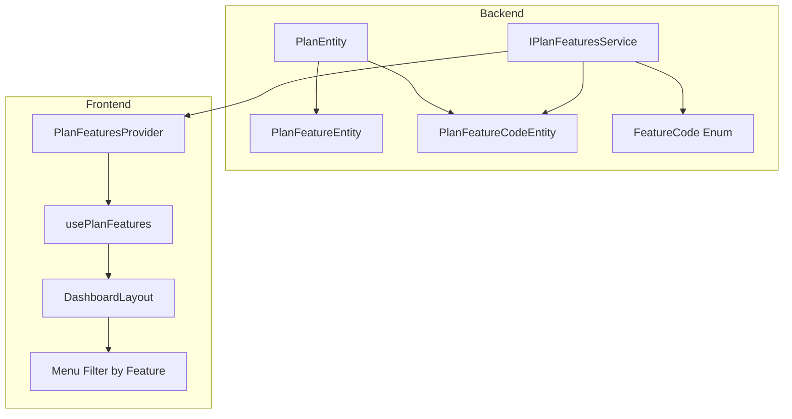
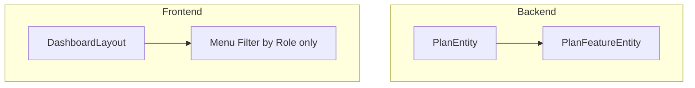

# Design Document: Simplify Plan System

## Overview

Thiết kế này mô tả việc đơn giản hóa hệ thống Plan/Feature của Tamabee HR. Mục tiêu là loại bỏ logic kiểm tra feature theo plan, giữ lại chỉ sự khác biệt về số lượng nhân viên (max_employees) và giá giữa các plans.

### Phạm vi thay đổi

**Backend (api-hr):**

- Xóa bảng `plan_feature_codes` và các entity/repository liên quan
- Xóa enum `FeatureCode`
- Xóa service `IPlanFeaturesService` và implementation
- Cập nhật migration V2

**Frontend (tama-hr):**

- Xóa `PlanFeaturesProvider` và `usePlanFeatures` hook
- Xóa logic filter menu theo feature trong `DashboardLayout`
- Cập nhật `menu-items.ts` để xóa `featureCode`
- Đơn giản hóa trang pricing và admin plans

## Architecture

### Kiến trúc hiện tại (Before)



### Kiến trúc mới (After)



## Components and Interfaces

### Backend - Files cần xóa

| File                                                | Lý do xóa                    |
| --------------------------------------------------- | ---------------------------- |
| `entity/wallet/PlanFeatureCodeEntity.java`          | Không còn cần feature codes  |
| `repository/wallet/PlanFeatureCodeRepository.java`  | Repository cho entity đã xóa |
| `enums/FeatureCode.java`                            | Enum không còn sử dụng       |
| `service/core/interfaces/IPlanFeaturesService.java` | Service không còn cần        |
| `service/core/impl/PlanFeaturesServiceImpl.java`    | Implementation không còn cần |
| `dto/response/wallet/PlanFeaturesResponse.java`     | Response DTO không còn cần   |
| `controller` endpoint cho `/plans/{id}/features`    | API không còn cần            |

### Backend - Files cần cập nhật

| File                    | Thay đổi                                                      |
| ----------------------- | ------------------------------------------------------------- |
| `V1__init_schema.sql`   | Xóa bảng `plan_feature_codes`                                 |
| `V2__init_settings.sql` | Xóa INSERT vào `plan_feature_codes`, cập nhật `plan_features` |

### Frontend - Files cần xóa

| File                                   | Lý do xóa              |
| -------------------------------------- | ---------------------- |
| `providers/plan-features-provider.tsx` | Provider không còn cần |
| `hooks/use-plan-features.ts`           | Hook không còn cần     |
| `lib/utils/has-feature.ts`             | Utility không còn cần  |

### Frontend - Files cần cập nhật

| File                                        | Thay đổi                                     |
| ------------------------------------------- | -------------------------------------------- |
| `app/[locale]/layout.tsx`                   | Xóa `PlanFeaturesProvider`                   |
| `app/[locale]/(DashboardLayout)/layout.tsx` | Xóa logic filter theo feature                |
| `constants/menu-items.ts`                   | Xóa `featureCode` từ menu items              |
| `types/plan.ts`                             | Xóa `PlanFeature`, `PlanFeaturesContextType` |
| `lib/apis/plan-api.ts`                      | Xóa `getPlanFeatures()`                      |

## Data Models

### PlanEntity (Giữ nguyên)

```java
@Entity
@Table(name = "plans")
public class PlanEntity extends BaseEntity {
    private Boolean deleted = false;
    private String nameVi;
    private String nameEn;
    private String nameJa;
    private String descriptionVi;
    private String descriptionEn;
    private String descriptionJa;
    private BigDecimal monthlyPrice;
    private Integer maxEmployees;
    private Boolean isActive = true;
}
```

### PlanFeatureEntity (Giữ nguyên)

```java
@Entity
@Table(name = "plan_features")
public class PlanFeatureEntity extends BaseEntity {
    private Boolean deleted = false;
    private Long planId;
    private String featureVi;
    private String featureEn;
    private String featureJa;
    private Integer sortOrder = 0;
    private Boolean isHighlighted = false;
}
```

### Migration V2 - Plans Data (Cập nhật)

```sql
-- Plans giữ nguyên structure, chỉ khác max_employees và price
INSERT INTO plans (id, name_vi, name_en, name_ja, ..., monthly_price, max_employees) VALUES
    (0, 'Gói Miễn phí', 'Free Plan', 'フリープラン', ..., 0, 5),
    (1, 'Gói Cơ bản', 'Basic Plan', 'ベーシックプラン', ..., 5000, 10),
    (2, 'Gói Tiêu chuẩn', 'Standard Plan', 'スタンダードプラン', ..., 10000, 50),
    (3, 'Gói Doanh nghiệp', 'Enterprise Plan', 'エンタープライズプラン', ..., 20000, 200),
    (4, 'Gói Tùy chỉnh', 'Custom Plan', 'カスタムプラン', ..., 0, 0);
```

### Migration V2 - Plan Features Data (Cập nhật)

```sql
-- Features chung cho tất cả plans (chỉ khác max_employees)
-- Mỗi plan có feature đầu tiên là max_employees, còn lại giống nhau
INSERT INTO plan_features (plan_id, feature_vi, feature_en, feature_ja, sort_order, is_highlighted) VALUES
    -- Free Plan
    (0, 'Tối đa 5 nhân viên', 'Up to 5 employees', '最大5名', 1, true),
    (0, 'Chấm công đầy đủ', 'Full attendance', '勤怠管理', 2, false),
    (0, 'Quản lý nghỉ phép', 'Leave management', '休暇管理', 3, false),
    (0, 'Tính lương tự động', 'Auto payroll', '給与計算', 4, false),
    -- Basic Plan
    (1, 'Tối đa 10 nhân viên', 'Up to 10 employees', '最大10名', 1, true),
    (1, 'Chấm công đầy đủ', 'Full attendance', '勤怠管理', 2, false),
    ...
```

## Correctness Properties

_Correctness properties là các đặc tính hoặc hành vi phải đúng trong mọi trường hợp thực thi hợp lệ của hệ thống - về cơ bản là các phát biểu chính thức về những gì hệ thống phải làm._

### Property 1: Menu rendering không filter theo feature

_For any_ user với bất kỳ role nào, menu items trong DashboardLayout SHALL được hiển thị dựa trên role của user, KHÔNG dựa trên feature codes của plan.

**Validates: Requirements 4.4**

### Property 2: API Plan response chứa features text

_For any_ valid plan ID, API `GET /api/plans/{planId}` SHALL trả về response chứa danh sách features với đầy đủ text đa ngôn ngữ (featureVi, featureEn, featureJa).

**Validates: Requirements 7.3**

### Property 3: Price formatting consistency

_For any_ plan với monthlyPrice > 0, hệ thống SHALL hiển thị giá theo format JPY (¥X,XXX) và quy đổi sang currency của locale hiện tại.

**Validates: Requirements 5.3**

## Error Handling

### Backend

| Scenario           | Handling                                  |
| ------------------ | ----------------------------------------- |
| Plan không tồn tại | Throw `NotFoundException.plan(planId)`    |
| Plan bị deleted    | Không trả về trong danh sách active plans |

### Frontend

| Scenario               | Handling                                |
| ---------------------- | --------------------------------------- |
| API lỗi khi load plans | Hiển thị error message, không crash app |
| Plan không có features | Hiển thị empty list, không crash        |

## Testing Strategy

### Unit Tests

**Backend:**

- Test `PlanService.getActivePlans()` trả về plans với features
- Test `PlanService.getPlanById()` trả về plan với features
- Test migration V2 không còn reference đến `plan_feature_codes`

**Frontend:**

- Test `DashboardLayout` render menu items theo role only
- Test `PricingSection` hiển thị plans với max_employees
- Test price formatting với các locales khác nhau

### Integration Tests

- Test API `GET /api/plans` trả về danh sách plans với features
- Test API `GET /api/plans/{id}` trả về plan detail với features
- Test API `GET /api/plans/{id}/features` trả về 404 (endpoint đã xóa)

### Property-Based Tests

Do spec này chủ yếu là về xóa code và đơn giản hóa structure, không có nhiều functional logic cần property-based testing. Các tests chính là:

1. **Menu rendering property**: Verify menu items được filter đúng theo role
2. **API response property**: Verify plan response luôn chứa features array
