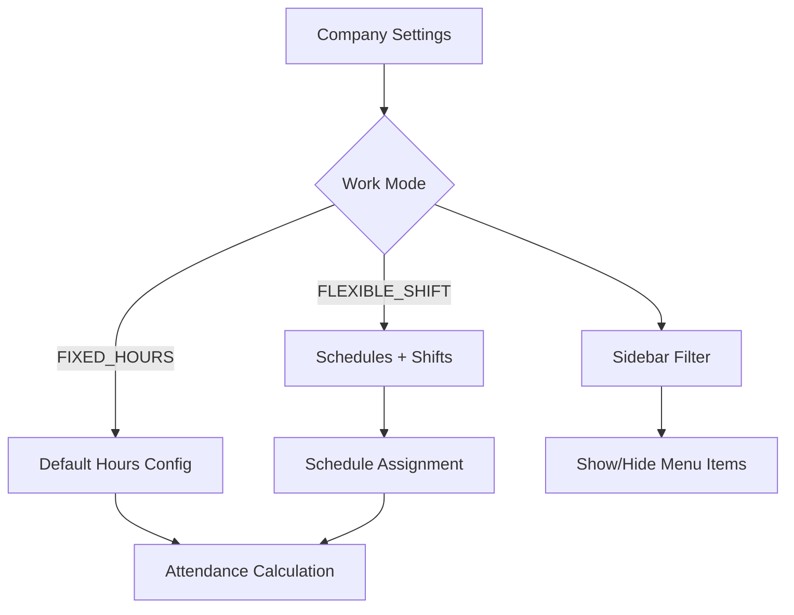

# Design Document: Work Schedule Redesign

## Overview

Thiết kế lại hệ thống quản lý lịch làm việc và Company Settings để phù hợp với nhiều loại hình doanh nghiệp. Hệ thống sẽ phân biệt rõ ràng giữa hai chế độ làm việc:

1. **FIXED_HOURS (Giờ cố định)**: Nhân viên làm việc theo giờ cố định hàng ngày, không cần phân ca. Phù hợp với văn phòng, công ty hành chính.

2. **FLEXIBLE_SHIFT (Linh hoạt/Theo ca)**: Nhân viên có thể được phân vào các ca làm việc khác nhau. Phù hợp với nhà máy, bán lẻ, dịch vụ 24/7.

## Architecture

### Component Structure

```
src/app/[locale]/(AdminLayout)/company/
├── settings/
│   ├── page.tsx
│   ├── _settings-tabs.tsx (updated)
│   ├── _work-mode-selector.tsx (new)
│   ├── _explanation-panel.tsx (new)
│   ├── _quick-setup-wizard.tsx (new)
│   └── ... (existing config forms)
├── schedules/
│   ├── page.tsx (updated)
│   ├── _schedule-summary-card.tsx (new)
│   ├── _schedule-wizard.tsx (new)
│   ├── _schedule-timeline.tsx (new)
│   └── ... (existing components)
├── shifts/
│   ├── _shifts-tabs.tsx (updated - conditional tabs)
│   └── ...
└── _components/
    └── _company-sidebar-items.tsx (updated - conditional items)
```

### Data Flow



## Components and Interfaces

### 1. WorkModeSelector Component

```typescript
interface WorkModeSelectorProps {
  currentMode: WorkMode;
  onModeChange: (mode: WorkMode) => void;
  disabled?: boolean;
}

type WorkMode = "FIXED_HOURS" | "FLEXIBLE_SHIFT";

interface WorkModeConfig {
  mode: WorkMode;
  defaultWorkStartTime: string;
  defaultWorkEndTime: string;
  defaultBreakMinutes: number;
}
```

**Behavior:**

- Hiển thị 2 card lớn với icon và mô tả cho mỗi mode
- Khi chọn mode khác, hiện confirmation dialog
- Lưu mode vào company settings

### 2. ExplanationPanel Component

```typescript
interface ExplanationPanelProps {
  title: string;
  description: string;
  tips?: string[];
  workModeNote?: string;
  defaultCollapsed?: boolean;
}
```

**Behavior:**

- Hiển thị ở đầu mỗi section settings
- Có thể collapse/expand
- Hiển thị tips dạng bullet list
- Hiển thị note về work mode nếu có

### 3. ScheduleSummaryCard Component

```typescript
interface ScheduleSummaryCardProps {
  workMode: WorkMode;
  defaultSchedule?: WorkSchedule;
  totalSchedules: number;
  totalAssignments: number;
}
```

**Behavior:**

- Hiển thị work mode hiện tại với badge
- Hiển thị default schedule (nếu có)
- Hiển thị thống kê: số schedules, số assignments

### 4. ScheduleWizard Component

```typescript
interface ScheduleWizardProps {
  onComplete: (schedule: WorkScheduleInput) => void;
  onCancel: () => void;
  initialData?: Partial<WorkScheduleInput>;
}

interface WizardStep {
  id: string;
  title: string;
  description: string;
  component: React.ComponentType;
}
```

**Steps:**

1. Basic Info (name, type)
2. Working Hours (start, end)
3. Break Configuration
4. Review & Confirm

### 5. ScheduleTimeline Component

```typescript
interface ScheduleTimelineProps {
  workStartTime: string;
  workEndTime: string;
  breakPeriods: BreakPeriod[];
  isOvernight?: boolean;
}
```

**Behavior:**

- Hiển thị timeline 24h
- Highlight working hours
- Hiển thị break periods với màu khác
- Hỗ trợ overnight schedules

### 6. Updated Sidebar Logic

```typescript
interface SidebarFilterConfig {
  workMode: WorkMode;
  hiddenItems: string[];
  partialItems: {
    itemUrl: string;
    hiddenTabs: string[];
  }[];
}

// FIXED_HOURS mode config
const fixedHoursConfig: SidebarFilterConfig = {
  workMode: "FIXED_HOURS",
  hiddenItems: ["/company/schedules"],
  partialItems: [
    {
      itemUrl: "/company/shifts",
      hiddenTabs: ["templates"],
    },
  ],
};
```

## Data Models

### Updated CompanySettings

```typescript
interface CompanySettings {
  // New field
  workModeConfig: WorkModeConfig;

  // Existing fields
  attendanceConfig: AttendanceConfig;
  payrollConfig: PayrollConfig;
  overtimeConfig: OvertimeConfig;
  breakConfig: BreakConfig;
  allowanceConfig: AllowanceConfig;
  deductionConfig: DeductionConfig;
}

interface WorkModeConfig {
  mode: WorkMode;
  // Chỉ dùng khi mode = FIXED_HOURS
  defaultWorkStartTime: string;
  defaultWorkEndTime: string;
  defaultBreakMinutes: number;
  // Metadata
  lastModeChangeAt?: string;
  lastModeChangeBy?: string;
}
```

### WorkModeChangeLog (Audit)

```typescript
interface WorkModeChangeLog {
  id: number;
  companyId: number;
  previousMode: WorkMode;
  newMode: WorkMode;
  changedBy: string;
  changedAt: string;
  reason?: string;
}
```

## Correctness Properties

_A property is a characteristic or behavior that should hold true across all valid executions of a system—essentially, a formal statement about what the system should do. Properties serve as the bridge between human-readable specifications and machine-verifiable correctness guarantees._

### Property 1: Work Mode Persistence Round-Trip

_For any_ valid work mode configuration, saving to the API and then fetching should return an equivalent configuration with the same mode and default hours.

**Validates: Requirements 1.6, 8.2**

### Property 2: Sidebar Filtering by Work Mode

_For any_ work mode setting, the sidebar items returned by `useCompanySidebarGroups` should correctly include or exclude the Schedules menu item based on the mode (hidden for FIXED_HOURS, visible for FLEXIBLE_SHIFT).

**Validates: Requirements 2.2, 4.1**

### Property 3: Attendance Calculation Uses Correct Hours

_For any_ attendance record in FIXED_HOURS mode, the working hours used for calculation should equal the company's default working hours configuration.

**Validates: Requirements 2.5, 2.6**

### Property 4: Flexible Mode Requires Default Schedule

_For any_ company in FLEXIBLE_SHIFT mode, attempting to save settings without at least one default schedule should result in a validation error.

**Validates: Requirements 3.3**

### Property 5: Schedules Grouped by Type

_For any_ list of schedules displayed on the Schedule Page, schedules should be grouped by their type (FIXED, FLEXIBLE, SHIFT) with each group containing only schedules of that type.

**Validates: Requirements 6.2**

### Property 6: Break Periods Within Work Hours Validation

_For any_ break period configuration, the break start and end times must fall within the work start and end times (accounting for overnight schedules).

**Validates: Requirements 6.5**

### Property 7: Settings Sections Visibility by Work Mode

_For any_ work mode, the settings page should show/hide sections appropriately (e.g., schedule-related sections hidden in FIXED_HOURS mode).

**Validates: Requirements 7.3**

### Property 8: Incomplete Settings Highlighting

_For any_ settings state with missing required fields, those fields should be marked as incomplete/highlighted in the UI.

**Validates: Requirements 7.5**

### Property 9: Mode Switch Preserves Schedules as Inactive

_For any_ company switching from FLEXIBLE_SHIFT to FIXED_HOURS mode, all existing schedules should be preserved in the database with an inactive status.

**Validates: Requirements 8.3**

### Property 10: Work Mode Changes Audit Logging

_For any_ work mode change operation, an audit log entry should be created containing the previous mode, new mode, timestamp, and user who made the change.

**Validates: Requirements 8.4**

## Error Handling

### Work Mode Change Errors

| Error Code                          | Condition                                      | User Message                                                   |
| ----------------------------------- | ---------------------------------------------- | -------------------------------------------------------------- |
| `WORK_MODE_CHANGE_FAILED`           | API error during mode change                   | "Không thể thay đổi chế độ làm việc. Vui lòng thử lại."        |
| `FLEXIBLE_MODE_NO_DEFAULT_SCHEDULE` | Switching to FLEXIBLE without default schedule | "Chế độ linh hoạt yêu cầu ít nhất một lịch làm việc mặc định." |
| `SCHEDULES_EXIST_WARNING`           | Switching to FIXED with active schedules       | "Các lịch làm việc hiện có sẽ được đánh dấu không hoạt động."  |

### Schedule Validation Errors

| Error Code                 | Condition                                  | User Message                                  |
| -------------------------- | ------------------------------------------ | --------------------------------------------- |
| `BREAK_OUTSIDE_WORK_HOURS` | Break period outside work hours            | "Thời gian nghỉ phải nằm trong giờ làm việc." |
| `INVALID_TIME_RANGE`       | End time before start time (non-overnight) | "Giờ kết thúc phải sau giờ bắt đầu."          |
| `SCHEDULE_HAS_ASSIGNMENTS` | Deleting schedule with assignments         | "Không thể xóa lịch đang được sử dụng."       |

## Testing Strategy

### Unit Tests

Unit tests sẽ tập trung vào:

- Component rendering với các props khác nhau
- Form validation logic
- Utility functions (time calculations, filtering)
- Error handling

### Property-Based Tests

Sử dụng **fast-check** library cho TypeScript để implement property-based tests.

Mỗi property test sẽ:

- Chạy tối thiểu 100 iterations
- Được annotate với property number và requirements reference
- Generate random valid inputs để test invariants

**Test Configuration:**

```typescript
import fc from "fast-check";

// Minimum 100 iterations per property
const testConfig = { numRuns: 100 };
```

**Property Test Examples:**

```typescript
// Property 1: Work Mode Persistence Round-Trip
describe("Property 1: Work Mode Persistence", () => {
  it("should persist and retrieve work mode correctly", () => {
    fc.assert(
      fc.property(
        fc.oneof(fc.constant("FIXED_HOURS"), fc.constant("FLEXIBLE_SHIFT")),
        fc
          .string({ minLength: 5, maxLength: 5 })
          .map((s) => s.slice(0, 2) + ":" + s.slice(2, 4)),
        (mode, time) => {
          // Save and retrieve should return equivalent config
          const config = { mode, defaultWorkStartTime: "09:00" };
          const saved = saveWorkModeConfig(config);
          const retrieved = getWorkModeConfig();
          return retrieved.mode === config.mode;
        },
      ),
      testConfig,
    );
  });
});

// Property 6: Break Periods Within Work Hours
describe("Property 6: Break Validation", () => {
  it("should validate break periods are within work hours", () => {
    fc.assert(
      fc.property(
        timeArbitrary(), // workStart
        timeArbitrary(), // workEnd
        timeArbitrary(), // breakStart
        timeArbitrary(), // breakEnd
        (workStart, workEnd, breakStart, breakEnd) => {
          const isValid = isBreakWithinWorkHours(
            breakStart,
            breakEnd,
            workStart,
            workEnd,
          );
          // If valid, break must be within work hours
          if (isValid) {
            return breakStart >= workStart && breakEnd <= workEnd;
          }
          return true;
        },
      ),
      testConfig,
    );
  });
});
```

### Integration Tests

- API integration tests cho work mode CRUD
- Sidebar rendering tests với different work modes
- Settings page flow tests
